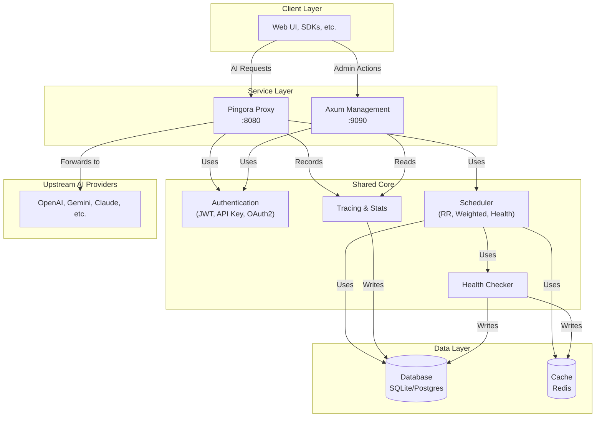
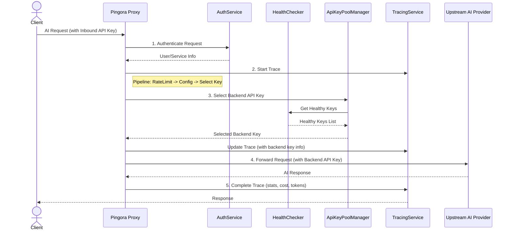

# AI Proxy Platform

> 基于 **Rust (2024 Edition)** + **Pingora** + **Axum** 构建的企业级 AI 服务代理平台，提供统一鉴权、动态路由、实时追踪与可视化运维能力。

  

## 🌐 架构速览



- **8080 端口 (Pingora)**：处理下游应用的实时 AI 请求，采用“透明代理”设计，内置灵活的认证、策略化密钥调度、健康检查、请求追踪与成本计算。
- **9090 端口 (Axum)**：提供管理服务与前端 UI，包括用户管理、密钥配置、使用统计、系统监控等能力。

## ✨ 核心能力

- 🔐 **多种认证模式**: 支持入口 API Key、JWT、OAuth 2.0 客户端凭证等多种认证方式，完全由数据库动态配置驱动。
- 🚀 **透明代理设计**: 用户决定请求格式与目标服务商，代理层只负责认证、密钥替换和转发，最大化兼容性。
- ⚖️ **智能调度与健康检查**: 提供轮询、权重、健康度优先等多种密钥池调度策略。实时被动+主动健康检查，自动隔离故障节点并恢复。
- 🔄 **OAuth 2.0 自动刷新**: 内置 `SmartApiKeyProvider` 和后台刷新任务，自动管理需要 OAuth 2.0 授权的后端密钥，保证服务高可用。
- 📊 **实时追踪与统计**: 所有请求的完整生命周期（包括重试）都被即时写入数据库。提供精确实时成本计算与 Token 统计，支持流式响应。
- ⚙️ **数据驱动配置**: 服务商认证方式、API 地址、超时、Token 计算方式等均从数据库加载，修改配置无需重启服务。
- 🛡️ **源信息隐藏**: 彻底隐藏客户端的 IP、API 密钥等信息，确保上游服务商只能看到代理本身。

## 📁 目录结构

```
├── src/
│   ├── proxy/                # Pingora 代理实现 (认证, 调度, 追踪等)
│   ├── management/           # Axum 管理接口 (用户, 密钥, 统计等)
│   ├── auth/                 # 统一认证模块 (API Key, JWT, OAuth2)
│   ├── scheduler/            # 负载均衡与健康检查
│   ├── trace/                # 即时追踪写入器
│   ├── statistics/           # 统一统计服务与成本计算
│   └── ...
├── web/                      # 前端应用 (React + ESBuild + shadcn/ui)
├── migration/                # SeaORM 数据库迁移脚本
└── README.md                 # 项目说明 (当前文件)
```

## 🚀 快速开始

### 1. 准备环境

- Rust 1.75+ (2024 Edition)
- Node.js 18+
- pnpm 8+
- Redis / PostgreSQL （如使用默认 SQLite，可省略）

### 2. 拉起后端服务

```bash
# 拉取依赖
cargo fetch

# 启动开发模式 (会自动运行数据库迁移)
cargo run
```

默认会监听：
- `http://127.0.0.1:8080` —— AI 代理入口
- `http://127.0.0.1:9090` —— 管理 API & 前端页面

### 3. 启动前端（可选）

```bash
cd web
pnpm install
pnpm dev
```

前端开发服务启动后，可直接在浏览器访问 `http://127.0.0.1:8000`。

## 🔄 数据流说明



- 追踪数据实时写入 `proxy_tracing` 表，前端日志页面 & ProviderKey 弹窗使用同一数据源。
- 折线图展示的 7 天请求与花费趋势来自管理端接口 `/provider-keys/keys/{id}/trends`，后端计算每日请求数与成本。

## 🧭 关键管理接口

| 功能 | HTTP | 路径 | 说明 |
| ---- | ---- | ---- | ---- |
| 获取日志列表 | GET | `/logs/traces` | 支持分页、搜索、过滤，列表不再返回 `request_id`（仅详情接口返回）。|
| 日志详情 | GET | `/logs/traces/:id` | 返回完整追踪信息（含 `request_id`、Token、费用等）。|
| Provider Key 统计 | GET | `/provider-keys/keys/:id/stats` | 基础概览卡片、使用统计、限流配置。|
| Provider Key 趋势 | GET | `/provider-keys/keys/:id/trends?days=7` | 返回 `date/requests/cost` 等字段，前端折线图直接消费。|
| 健康检查 | POST | `/provider-keys/keys/:id/health-check` | 触发单个密钥健康检查并异步刷新状态。|

更多接口可参考 `src/management/handlers` 目录下的实现。

## 🛠️ 常用开发脚本

```bash
# 代码格式化
cargo fmt

# 类型检查
cargo check

# 运行单元/集成测试
cargo test

# 前端构建（web/）
pnpm build
```

## 📈 前端看板亮点

- **日志页**：可按模型、状态码、账号密钥名称筛选，详情弹窗展示完整追踪信息。
- **Provider Keys**：支持实时趋势折线图（请求量、花费）、健康状态标签、一键健康检查。
- **用户 Keys**：提供每日请求/Token 折线图与综合趋势图，支持多维度洞察。

## 🤝 贡献

欢迎提交 Issue 或 PR。开发流程：

1. Fork 项目 & 新建分支
2. 完成功能并补充必要测试
3. `cargo fmt` & `cargo check` & `pnpm build`
4. 提交 PR，描述变更场景

## 📄 许可证

本项目基于 [MIT License](LICENSE) 开源，可自由使用与二次开发。

---

> 若需部署、定制接入更多厂商或建设企业级监控，请参考 `docs/` 目录中的设计文档与流水线说明。
