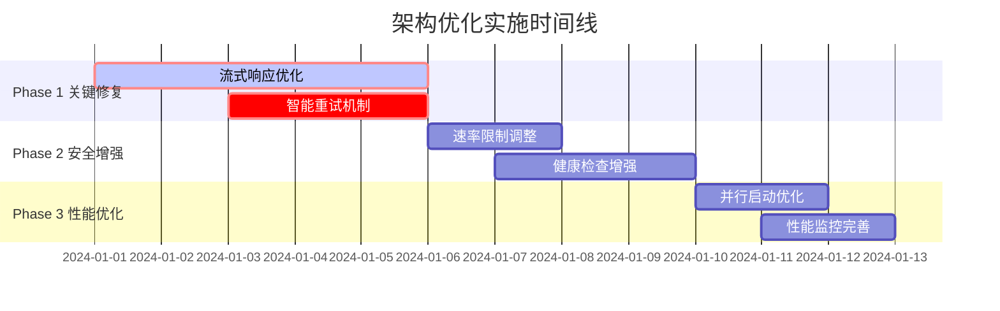

# 架构优化方案

## 概述

本文档详细描述了基于源码深度分析发现的5个关键架构问题的优化方案。这些优化将显著提升系统的用户体验、安全性和性能。

## 关键问题分析

### 1. 流式响应缓冲问题 (最严重)

**问题描述**: 当前系统完全缓冲响应体，破坏了LLM服务的实时流式体验。

**影响等级**: 🔴 严重 - 直接影响用户体验

**问题位置**:
- `src/proxy/service.rs:330-353` - `response_body_filter()` 方法缓冲所有响应数据
- `src/proxy/request_handler.rs:134` - `ResponseDetails::add_body_chunk()` 累积响应数据
- `src/proxy/request_handler.rs:183` - `finalize_body()` 仅在完整响应后处理

**技术原因分析**:
```rust
// 当前实现 - 问题代码
fn response_body_filter(&self, body: &mut Option<Bytes>, ctx: &mut Self::CTX) {
    if let Some(data) = body {
        ctx.response_details.add_body_chunk(data); // 缓冲所有数据
    }
}
```

### 2. 重试机制缺陷

**问题描述**: 重试使用相同失败的API密钥，无法有效恢复失败请求。

**影响等级**: 🟡 中等 - 影响系统可用性

**问题位置**: `src/proxy/service.rs:380-429` - `fail_to_proxy()` 方法

**技术原因**: 注释明确表明"使用相同的API密钥重试"，缺乏智能重试策略。

### 3. 认证顺序安全隐患

**问题描述**: 认证在速率限制之前执行，可能导致DDoS攻击。

**影响等级**: 🟠 重要 - 安全漏洞

**问题位置**: `src/proxy/request_handler.rs:413-453` - 认证先于速率限制执行

### 4. 健康检查系统局限

**问题描述**: 缺乏被动健康检查，无法及时发现API密钥问题。

**影响等级**: 🟡 中等 - 影响服务质量

### 5. 系统启动性能问题

**问题描述**: 线性启动导致系统初始化时间过长。

**影响等级**: 🟡 中等 - 影响部署效率

## 详细优化方案

### Phase 1: 关键问题修复 (立即实施)

#### 1.1 流式响应优化

**目标**: 实现真正的流式响应传输，支持Server-Sent Events (SSE)。

**技术方案**:

1. **引入流式上下文管理**（保持与 Pipeline/ProxyService 兼容）:
```rust
pub struct StreamingResponseContext {
    pub token_extractor: TokenFieldExtractor,
    pub model_extractor: ModelExtractor,
    pub start_time: Instant,
    pub first_token_time: Option<Instant>,
    pub chunk_count: u32,
    pub streaming_enabled: bool,
}
```

2. **重构响应过滤器**:
```rust
fn response_body_filter(&self, body: &mut Option<Bytes>, ctx: &mut Self::CTX) -> Result<(), Box<Error>> {
    if let Some(data) = body {
        // 实时处理流式数据
        if ctx.streaming_context.streaming_enabled {
            self.process_streaming_chunk(data, ctx)?;
        } else {
            // 非流式响应保持原有逻辑
            ctx.response_details.add_body_chunk(data);
        }
    }
    Ok(())
}
```

3. **实现流式数据处理**:
```rust
fn process_streaming_chunk(&self, chunk: &Bytes, ctx: &mut ProxyContext) -> Result<(), Box<Error>> {
    // 检测首个token时间
    if ctx.streaming_context.first_token_time.is_none() {
        ctx.streaming_context.first_token_time = Some(Instant::now());
    }
    
    // 增量提取token信息
    if let Ok(tokens) = ctx.streaming_context.token_extractor.extract_incremental(chunk) {
        ctx.response_details.add_streaming_tokens(tokens);
    }
    
    // 增量提取模型信息
    if let Some(model) = ctx.streaming_context.model_extractor.extract_from_chunk(chunk) {
        ctx.response_details.set_model(model);
    }
    
    ctx.streaming_context.chunk_count += 1;
    Ok(())
}
```

4. **修改统计记录时机**:
```rust
// 在每个chunk处理后更新统计
fn update_streaming_statistics(&self, ctx: &ProxyContext) {
    let stats = StreamingStatistics {
        request_id: ctx.request_id.clone(),
        chunk_count: ctx.streaming_context.chunk_count,
        first_token_latency: ctx.streaming_context.first_token_time
            .map(|t| t.duration_since(ctx.streaming_context.start_time)),
        streaming_duration: ctx.streaming_context.start_time.elapsed(),
    };
    
    // 异步更新统计，避免阻塞流式传输
    tokio::spawn(async move {
        self.statistics_service.update_streaming_stats(stats).await;
    });
}
```

**实现步骤**:
1. 在`RequestHandler`中添加流式检测逻辑
2. 重构`response_body_filter`支持流式处理
3. 实现增量token/model提取器
4. 修改统计服务支持流式更新
5. 添加流式响应的性能监控

#### 1.2 智能重试机制

**目标**: 实现基于API密钥健康状态的智能重试策略。

**技术方案**:

1. **智能重试管理器**:
```rust
pub struct IntelligentRetryManager {
    pool_manager: Arc<ApiKeyPoolManager>,
    health_checker: Arc<ApiKeyHealthChecker>,
    retry_config: RetryConfig,
}

pub struct RetryConfig {
    pub max_retries: u32,
    pub retry_delay: Duration,
    pub blacklist_duration: Duration,
    pub health_check_threshold: f64,
}
```

2. **重试决策逻辑**:
```rust
impl IntelligentRetryManager {
    pub async fn should_retry_with_different_key(
        &self,
        failed_key: &str,
        error: &ProxyError,
        attempt: u32,
    ) -> Option<String> {
        if attempt >= self.retry_config.max_retries {
            return None;
        }
        
        // 根据错误类型决定是否重试
        if !self.is_retryable_error(error) {
            return None;
        }
        
        // 标记失败的API密钥
        self.health_checker.mark_api_key_failed(failed_key, error).await;
        
        // 获取健康的API密钥
        self.pool_manager.get_healthy_api_key().await
    }
    
    fn is_retryable_error(&self, error: &ProxyError) -> bool {
        match error {
            ProxyError::RateLimitExceeded => true,
            ProxyError::ServerError(_) => true,
            ProxyError::Timeout => true,
            ProxyError::AuthenticationFailed => false, // 不重试认证错误
            ProxyError::InvalidRequest => false, // 不重试无效请求
            _ => false,
        }
    }
}
```

3. **重构失败处理流程**:
```rust
async fn handle_proxy_failure(
    &self,
    ctx: &mut ProxyContext,
    error: ProxyError,
) -> Result<Response<Body>, Box<Error>> {
    let retry_manager = &self.retry_manager;
    
    // 尝试智能重试
    if let Some(new_api_key) = retry_manager
        .should_retry_with_different_key(&ctx.selected_api_key, &error, ctx.retry_count)
        .await
    {
        info!(
            "Retrying request {} with different API key: {} -> {}",
            ctx.request_id, ctx.selected_api_key, new_api_key
        );
        
        ctx.selected_api_key = new_api_key;
        ctx.retry_count += 1;
        
        // 使用新API密钥重新发起请求
        return self.forward_request_with_retry(ctx).await;
    }
    
    // 无法重试，返回错误
    self.create_error_response(&error)
}
```

**实现步骤**:
1. 创建`IntelligentRetryManager`组件
2. 增强`ApiKeyHealthChecker`支持动态健康评估
3. 重构`fail_to_proxy`方法使用智能重试
4. 添加重试策略配置和监控
5. 实现重试性能指标收集

### Phase 2: 安全和可靠性增强

#### 2.1 速率限制优先级调整

**目标**: 将速率限制移至认证之前，防止DDoS攻击。

**技术方案**:

1. **重新设计请求处理管道**:
```rust
// 新的处理顺序
pub async fn handle_request(&self, req: Request<Body>) -> Result<Response<Body>, Box<Error>> {
    let mut ctx = ProxyContext::new(req);
    
    // 1. IP级别速率限制 (最优先)
    self.apply_ip_rate_limiting(&mut ctx).await?;
    
    // 2. 全局速率限制
    self.apply_global_rate_limiting(&mut ctx).await?;
    
    // 3. 身份认证
    self.authenticate_request(&mut ctx).await?;
    
    // 4. 用户级别速率限制
    self.apply_user_rate_limiting(&mut ctx).await?;
    
    // 5. 后续处理逻辑
    self.process_authenticated_request(ctx).await
}
```

2. **分层速率限制器**:
```rust
pub struct LayeredRateLimiter {
    ip_limiter: Arc<IpRateLimiter>,
    global_limiter: Arc<GlobalRateLimiter>,
    user_limiter: Arc<UserRateLimiter>,
}

impl LayeredRateLimiter {
    pub async fn check_ip_limit(&self, client_ip: &str) -> Result<(), RateLimitError> {
        self.ip_limiter.check(client_ip).await
    }
    
    pub async fn check_global_limit(&self) -> Result<(), RateLimitError> {
        self.global_limiter.check().await
    }
    
    pub async fn check_user_limit(&self, user_id: &str) -> Result<(), RateLimitError> {
        self.user_limiter.check(user_id).await
    }
}
```

3. **增强错误响应**:
```rust
fn create_rate_limit_response(&self, limit_type: RateLimitType) -> Response<Body> {
    let error_response = match limit_type {
        RateLimitType::IpLimit => ErrorResponse {
            error: "rate_limit_exceeded".to_string(),
            message: "IP请求频率超限，请稍后重试".to_string(),
            retry_after: Some(60),
        },
        RateLimitType::GlobalLimit => ErrorResponse {
            error: "service_busy".to_string(),
            message: "服务繁忙，请稍后重试".to_string(),
            retry_after: Some(30),
        },
        RateLimitType::UserLimit => ErrorResponse {
            error: "user_quota_exceeded".to_string(),
            message: "用户配额已用完".to_string(),
            retry_after: None,
        },
    };
    
    Response::builder()
        .status(StatusCode::TOO_MANY_REQUESTS)
        .header("Content-Type", "application/json")
        .body(Body::from(serde_json::to_string(&error_response).unwrap()))
        .unwrap()
}
```

#### 2.2 增强健康检查系统

**目标**: 实现被动健康检查和智能故障转移。

**技术方案**:

1. **被动健康监控器**:
```rust
pub struct PassiveHealthMonitor {
    health_metrics: Arc<RwLock<HashMap<String, HealthMetrics>>>,
    circuit_breakers: Arc<RwLock<HashMap<String, CircuitBreaker>>>,
    config: PassiveHealthConfig,
}

pub struct HealthMetrics {
    pub success_rate: f64,
    pub avg_response_time: Duration,
    pub error_count: u32,
    pub total_requests: u32,
    pub last_success: Option<Instant>,
    pub consecutive_failures: u32,
}

impl PassiveHealthMonitor {
    pub async fn record_request_result(
        &self,
        api_key: &str,
        result: RequestResult,
        response_time: Duration,
    ) {
        let mut metrics = self.health_metrics.write().await;
        let metric = metrics.entry(api_key.to_string()).or_insert_with(HealthMetrics::default);
        
        metric.total_requests += 1;
        match result {
            RequestResult::Success => {
                metric.last_success = Some(Instant::now());
                metric.consecutive_failures = 0;
                self.update_circuit_breaker(api_key, true).await;
            }
            RequestResult::Error(error_type) => {
                metric.error_count += 1;
                metric.consecutive_failures += 1;
                
                if metric.consecutive_failures >= self.config.failure_threshold {
                    self.trigger_circuit_breaker(api_key).await;
                }
            }
        }
        
        // 更新平均响应时间
        metric.avg_response_time = self.calculate_moving_average(
            metric.avg_response_time,
            response_time,
            metric.total_requests,
        );
        
        // 更新成功率
        metric.success_rate = (metric.total_requests - metric.error_count) as f64 
            / metric.total_requests as f64;
    }
}
```

2. **熔断器实现**:
```rust
pub struct CircuitBreaker {
    state: CircuitBreakerState,
    failure_count: u32,
    last_failure_time: Option<Instant>,
    config: CircuitBreakerConfig,
}

#[derive(Clone, Copy, Debug)]
pub enum CircuitBreakerState {
    Closed,      // 正常状态
    Open,        // 熔断状态
    HalfOpen,    // 半开状态，尝试恢复
}

impl CircuitBreaker {
    pub fn can_execute(&self) -> bool {
        match self.state {
            CircuitBreakerState::Closed => true,
            CircuitBreakerState::Open => {
                if let Some(last_failure) = self.last_failure_time {
                    last_failure.elapsed() >= self.config.timeout
                } else {
                    false
                }
            }
            CircuitBreakerState::HalfOpen => true,
        }
    }
    
    pub fn on_success(&mut self) {
        self.failure_count = 0;
        self.state = CircuitBreakerState::Closed;
    }
    
    pub fn on_failure(&mut self) {
        self.failure_count += 1;
        self.last_failure_time = Some(Instant::now());
        
        if self.failure_count >= self.config.failure_threshold {
            self.state = CircuitBreakerState::Open;
        }
    }
}
```

### Phase 3: 性能优化

#### 3.1 并行系统启动

**目标**: 通过并行初始化减少系统启动时间。

**技术方案**:

1. **并行初始化组件**:
```rust
pub async fn initialize_shared_services_parallel(
    matches: &ArgMatches,
) -> Result<(
    Arc<AppConfig>,
    Arc<DatabaseConnection>,
    SharedServices,
    Arc<UnifiedTraceSystem>,
)> {
    info!("🚀 Starting parallel service initialization...");
    
    // 第一阶段：配置加载和数据库初始化（必须串行）
    let (config_arc, db) = initialize_core_dependencies(matches).await?;
    
    // 第二阶段：并行初始化独立组件
    let initialization_futures = vec![
        initialize_auth_components(config_arc.clone(), db.clone()),
        initialize_cache_components(config_arc.clone()),
        initialize_provider_components(db.clone()),
        initialize_monitoring_components(db.clone()),
        initialize_oauth_components(db.clone()),
    ];
    
    let results = futures::future::try_join_all(initialization_futures).await?;
    
    // 第三阶段：组装依赖组件（需要前面组件的结果）
    let shared_services = assemble_shared_services(results).await?;
    
    // 第四阶段：启动后台任务
    start_background_tasks(&shared_services).await?;
    
    Ok((config_arc, db, shared_services, trace_system))
}
```

2. **独立组件初始化器**:
```rust
async fn initialize_auth_components(
    config: Arc<AppConfig>,
    db: Arc<DatabaseConnection>,
) -> Result<AuthComponents> {
    info!("🔐 Initializing authentication components...");
    
    let (auth_config, jwt_manager, api_key_manager) = tokio::try_join!(
        async { Ok(Arc::new(AuthConfig::default())) },
        async { 
            JwtManager::new(Arc::new(AuthConfig::default()))
                .map(Arc::new)
                .map_err(|e| ProxyError::server_init(format!("JWT manager: {}", e)))
        },
        async {
            Ok(Arc::new(ApiKeyManager::new(db.clone(), Arc::new(AuthConfig::default()))))
        }
    )?;
    
    let auth_service = Arc::new(AuthService::new(
        jwt_manager.clone(),
        api_key_manager.clone(),
        db.clone(),
        auth_config.clone(),
    ));
    
    Ok(AuthComponents {
        auth_config,
        jwt_manager,
        api_key_manager,
        auth_service,
    })
}

async fn initialize_cache_components(
    config: Arc<AppConfig>,
) -> Result<CacheComponents> {
    info!("💾 Initializing cache components...");
    
    let unified_cache_manager = Arc::new(
        UnifiedCacheManager::new(&config.cache, &config.redis.url)
            .map_err(|e| ProxyError::server_init(format!("Cache manager: {}", e)))?
    );
    
    Ok(CacheComponents {
        unified_cache_manager,
    })
}
```

3. **启动性能监控**:
```rust
pub struct StartupMetrics {
    pub total_startup_time: Duration,
    pub component_timings: HashMap<String, Duration>,
    pub parallel_efficiency: f64,
}

impl StartupMetrics {
    pub fn calculate_efficiency(&self) -> f64 {
        let sequential_time: Duration = self.component_timings.values().sum();
        let parallel_time = self.total_startup_time;
        
        if parallel_time.as_millis() > 0 {
            sequential_time.as_millis() as f64 / parallel_time.as_millis() as f64
        } else {
            1.0
        }
    }
}
```

## 实施计划

### 时间线和优先级



### 测试策略

1. **单元测试覆盖**:
   - 流式响应处理逻辑
   - 重试决策算法
   - 熔断器状态转换
   - 并行初始化逻辑

2. **集成测试场景**:
   - 端到端流式响应测试
   - 故障转移和恢复测试
   - 高并发负载测试
   - 系统启动性能测试

3. **性能基准**:
   - 流式响应首个token延迟 < 100ms
   - 系统启动时间 < 5秒
   - API密钥故障检测时间 < 30秒
   - 重试成功率 > 85%

### 风险评估和缓解

| 风险类型 | 概率 | 影响 | 缓解措施 |
|---------|------|------|---------|
| 流式实现复杂性 | 中 | 高 | 分阶段实施，充分测试 |
| 向后兼容性 | 低 | 中 | 保持API接口不变 |
| 性能回归 | 低 | 高 | 基准测试和监控 |
| 系统稳定性 | 中 | 高 | 金丝雀部署和回滚机制 |

### 监控和验证

1. **关键指标监控**:
   - 流式响应延迟分布
   - API密钥健康状态
   - 重试成功率
   - 系统启动时间

2. **告警配置**:
   - 流式响应异常告警
   - API密钥故障率告警
   - 系统性能回归告警

3. **用户体验验证**:
   - LLM对话流畅性测试
   - 服务可用性监控
   - 错误率趋势分析

## 总结

这个优化方案将显著提升AI代理平台的用户体验、安全性和性能。通过分阶段实施，我们可以最小化风险，确保系统稳定性的同时获得最大的改进效果。

关键改进预期：
- **用户体验**: 流式响应实现真正的实时LLM对话
- **系统可靠性**: 智能重试机制提高服务可用性
- **安全性**: 多层速率限制防止DDoS攻击  
- **性能**: 并行启动减少部署时间50%以上

建议立即开始Phase 1的实施，这将带来最直接和显著的用户体验提升。
