# AI 代理平台请求处理流程详细分析

> 基于 Rust + Pingora 的企业级 AI 服务代理平台完整技术流程文档

## 🏗️ 系统架构总览

### 双端口分离架构设计

这是一个基于**双端口分离架构**的企业级 AI 服务代理平台，采用以下核心设计：

- **Pingora 代理服务** (端口8080): 专注高性能AI请求代理，基于Pingora 0.5.0原生性能
- **Axum 管理服务** (端口9090): 专注业务管理逻辑，用户管理、API密钥管理、统计查询
- **共享数据层**: SQLite数据库 + Redis缓存 + 统一认证系统

### 技术栈组成

- **核心框架**: Rust 2024 Edition + Pingora 0.5.0 + Axum 0.8.4
- **数据库**: SQLite + Sea-ORM 1.1.13 + Sea-ORM-Migration
- **缓存**: Redis with connection manager
- **认证**: JWT + API Key + RBAC (17种权限类型)
- **前端**: Vue 3 + TypeScript + Element Plus (规划中)

## 📊 完整请求处理流程图

```mermaid
flowchart TD
    %% 客户端请求入口
    Client[客户端请求] --> ProxyPort[":8080 Pingora代理端口"]
    
    %% 系统启动阶段
    subgraph SystemStartup["🚀 系统启动阶段"]
        MainRS[main.rs] --> DualPort[dual_port_setup.rs]
        DualPort --> SharedServices[初始化共享服务]
        SharedServices --> DB[(SQLite数据库)]
        SharedServices --> Cache[(Redis缓存)]  
        SharedServices --> UnifiedAuth[统一认证系统]
        SharedServices --> TraceSystem[统一追踪系统]
        DualPort --> StartPingora[启动Pingora代理服务:8080]
        DualPort --> StartAxum[启动Axum管理服务:9090]
    end
    
    %% Pingora服务组件构建
    subgraph ProxyBuild["🔧 代理服务构建"]
        StartPingora --> ProxyServerBuilder[ProxyServerBuilder]
        ProxyServerBuilder --> BuildDB[ensure_database]
        BuildDB --> BuildCache[ensure_cache]
        BuildCache --> BuildProviderConfig[ensure_provider_config_manager]
        BuildProviderConfig --> CreateAuthManager[create_auth_manager]
        CreateAuthManager --> CreateProxyService[create_proxy_service]
        CreateProxyService --> ProxyComponents[ProxyServerComponents]
    end
    
    %% 请求处理主流程
    ProxyPort --> ProxyService[ProxyService::ProxyHttp]
    
    subgraph RequestFlow["🔄 请求处理流程"]
        ProxyService --> NewCtx[new_ctx: 创建ProxyContext]
        NewCtx --> RequestFilter[request_filter: 请求过滤]
        
        subgraph RequestFilterDetail["request_filter 详细流程"]
            RequestFilter --> CheckProxyReq{是否为代理请求?}
            CheckProxyReq -->|否| Return404[返回404错误]
            CheckProxyReq -->|是| HandleCORS{OPTIONS请求?}
            HandleCORS -->|是| Return200[返回200 CORS]
            HandleCORS -->|否| PrepareProxy[ai_handler.prepare_proxy_request]
        end
        
        subgraph PrepareProxyDetail["prepare_proxy_request 核心处理"]
            PrepareProxy --> Step0[步骤0: Provider解析<br/>ProviderResolver.resolve_from_request]
            Step0 --> Step1[步骤1: 身份验证<br/>AuthenticationService.authenticate]
            
            subgraph AuthFlow["🔐 认证流程详细"]
                Step1 --> ExtractKey[extract_api_key_from_request_with_provider<br/>根据provider配置提取API密钥]
                ExtractKey --> UnifiedAuthMgr[RefactoredUnifiedAuthManager<br/>.authenticate_proxy_request]
                UnifiedAuthMgr --> VerifyProvider[验证provider类型匹配]
                VerifyProvider --> AuthResult[构造AuthenticationResult]
            end
            
            Step1 --> Step2[步骤2: 开始追踪<br/>TracingService.start_trace]
            Step2 --> Step3[步骤3: 速率限制检查<br/>check_rate_limit]
            Step3 --> Step4[步骤4: 获取Provider配置<br/>get_provider_type]
            Step4 --> Step5[步骤5: API密钥选择<br/>select_api_key]
            
            subgraph LoadBalance["⚖️ 负载均衡详细"]
                Step5 --> CreateContext[创建SelectionContext]
                CreateContext --> ApiKeyPool[ApiKeyPoolManager<br/>.select_api_key_from_service_api]
                ApiKeyPool --> SelectAlgorithm{调度策略}
                SelectAlgorithm -->|round_robin| RoundRobin[轮询算法]
                SelectAlgorithm -->|weighted| Weighted[权重算法]
                SelectAlgorithm -->|health_best| HealthBest[健康度最佳]
                RoundRobin --> SelectedKey[返回ApiKeySelectionResult]
                Weighted --> SelectedKey
                HealthBest --> SelectedKey
            end
            
            Step5 --> UpdateTrace[更新追踪信息]
        end
        
        PrepareProxy --> UpstreamPeer[upstream_peer: 选择上游节点]
        
        subgraph UpstreamSelection["🎯 上游选择"]
            UpstreamPeer --> RetryDelay{重试请求?}
            RetryDelay -->|是| AddDelay[添加重试延迟]
            RetryDelay -->|否| SelectUpstream[ai_handler.select_upstream_peer]
            AddDelay --> SelectUpstream
            SelectUpstream --> BuildPeer[构建HttpPeer<br/>使用provider.base_url:443]
        end
        
        UpstreamPeer --> UpstreamReqFilter[upstream_request_filter: 上游请求过滤]
        
        subgraph UpstreamReqProcessing["🔄 上游请求处理"]
            UpstreamReqFilter --> FilterReq[ai_handler.filter_upstream_request]
            FilterReq --> ReplaceAuth[替换认证信息<br/>隐藏源信息]
            ReplaceAuth --> AddHeaders[添加必要请求头]
        end
        
        UpstreamReqFilter --> ResponseFilter[response_filter: 响应过滤]
        
        subgraph ResponseProcessing["📥 响应处理"]
            ResponseFilter --> FilterResp[ai_handler.filter_upstream_response]
            FilterResp --> ProcessHeaders[处理响应头]
            ProcessHeaders --> LogResponseTime[记录响应时间和状态]
        end
        
        ResponseFilter --> ResponseBodyFilter[response_body_filter: 响应体过滤]
        
        subgraph ResponseBodyProcessing["📝 响应体处理"]
            ResponseBodyFilter --> CollectChunks[收集响应体数据块<br/>ctx.response_details.add_body_chunk]
            CollectChunks --> LogChunkInfo[记录数据块信息]
        end
        
        ResponseBodyFilter --> ConnectedUpstream[connected_to_upstream: 连接监控]
        ConnectedUpstream --> FinalLogging[logging: 最终日志记录]
        
        subgraph FinalProcessing["✅ 最终处理"]
            FinalLogging --> CheckError{有错误?}
            CheckError -->|是| HandleError[处理错误<br/>convert_pingora_error]
            CheckError -->|否| ExtractStats[提取响应统计<br/>StatisticsService.extract_stats_from_response_body]
            HandleError --> CompleteTraceError[complete_trace with error]
            ExtractStats --> UpdateTokenUsage[更新token使用信息]
            UpdateTokenUsage --> CompleteTraceSuccess[complete_trace_with_stats]
            CompleteTraceError --> ClientResponse[返回客户端响应]
            CompleteTraceSuccess --> ClientResponse
        end
    end
    
    %% 错误处理分支
    subgraph ErrorHandling["⚠️ 错误处理"]
        Return404 --> ErrorResponse[错误响应]
        Return200 --> CorsResponse[CORS响应]
        PrepareProxy -->|失败| AuthError{认证错误}
        AuthError -->|401| Auth401[401未授权]
        AuthError -->|429| RateLimit429[429速率限制]
        AuthError -->|504| Timeout504[504超时]
        AuthError -->|502| Gateway502[502网关错误]
        Auth401 --> ErrorResponse
        RateLimit429 --> ErrorResponse
        Timeout504 --> ErrorResponse
        Gateway502 --> ErrorResponse
    end
    
    %% 重试机制
    subgraph RetryMechanism["🔄 重试机制"]
        FinalLogging --> FailToProxy{fail_to_proxy?}
        FailToProxy -->|是| CheckRetryable{可重试错误?}
        CheckRetryable -->|是| CheckRetryCount{未超过重试次数?}
        CheckRetryCount -->|是| IncrementRetry[增加重试计数<br/>ctx.retry_count++]
        IncrementRetry --> RetryUpstream[重试上游连接]
        RetryUpstream --> UpstreamPeer
        CheckRetryCount -->|否| MaxRetriesReached[达到最大重试次数]
        CheckRetryable -->|否| NonRetryableError[不可重试错误]
        MaxRetriesReached --> ErrorResponse
        NonRetryableError --> ErrorResponse
    end
    
    ClientResponse --> Client
    ErrorResponse --> Client
    CorsResponse --> Client
    
    %% 样式定义
    classDef startEnd fill:#e1f5fe
    classDef process fill:#f3e5f5
    classDef decision fill:#fff3e0
    classDef error fill:#ffebee
    classDef success fill:#e8f5e8
    
    class Client,ProxyPort startEnd
    class ProxyService,RequestFilter,PrepareProxy,UpstreamPeer process
    class CheckProxyReq,HandleCORS,CheckError decision
    class Return404,Auth401,RateLimit429 error
    class ClientResponse,CompleteTraceSuccess success
```



## 🔍 关键组件详细说明

### 1. 系统启动流程 (`src/main.rs:30` → `src/dual_port_setup.rs`)

```rust
main.rs:30 → dual_port_setup::run_dual_port_servers()
├── initialize_shared_services() // 初始化所有共享服务
│   ├── 数据库连接 (SQLite)
│   ├── 统一缓存管理器 (Redis)
│   ├── 认证系统 (RefactoredUnifiedAuthManager) 
│   ├── 统计服务 (StatisticsService)
│   ├── 追踪系统 (UnifiedTraceSystem)
│   └── OAuth客户端和智能API密钥提供者
└── 并发启动双端口服务
    ├── Pingora代理服务 :8080
    └── Axum管理服务 :9090
```

**关键代码路径：**
- `src/main.rs:30`: `dual_port_setup::run_dual_port_servers()`
- `src/dual_port_setup.rs:132`: `initialize_shared_services()`
- `src/dual_port_setup.rs:262`: 初始化UnifiedTraceSystem

### 2. 代理服务构建 (`src/proxy/builder.rs`)

```rust
ProxyServerBuilder::build_components():174
├── ensure_database() → Arc<DatabaseConnection>
├── ensure_cache() → Arc<UnifiedCacheManager>  
├── ensure_provider_config_manager() → Arc<ProviderConfigManager>
└── create_proxy_service() → ProxyService
    └── RequestHandler::new() // 核心业务逻辑处理器
```

**关键代码路径：**
- `src/proxy/builder.rs:174`: `build_components()`
- `src/proxy/builder.rs:148`: `create_proxy_service()`
- `src/proxy/service.rs:32`: `ProxyService::new()`

### 3. 请求处理核心链路 (`src/proxy/service.rs` + `src/proxy/request_handler.rs`)

```rust
ProxyService::request_filter():97 
├── 透明代理检查：除管理API外都作为AI代理请求
├── CORS预检处理  
└── RequestHandler::prepare_proxy_request():382
    ├── ProviderResolver::resolve_from_request() // 从URL识别provider
    ├── AuthenticationService::authenticate() // 身份验证
    ├── TracingService::start_trace() // 开始追踪
    ├── check_rate_limit() // 速率和限制检查
    ├── get_provider_type() // 获取provider配置
    └── ApiKeyPoolManager::select_api_key_from_service_api() // 负载均衡
```

**关键代码路径：**
- `src/proxy/service.rs:97`: `request_filter()`
- `src/proxy/request_handler.rs:382`: `prepare_proxy_request()`
- `src/proxy/service.rs:221`: `upstream_peer()`
- `src/proxy/service.rs:270`: `upstream_request_filter()`

### 4. 认证流程 (`src/proxy/authentication_service.rs`)

```rust
AuthenticationService::authenticate():291
├── extract_api_key_from_request_with_provider() // 提取API密钥
│   ├── 解析provider的auth_header_format配置
│   ├── 支持多种认证头格式：Authorization, X-API-Key等
│   └── Fallback到查询参数
├── RefactoredUnifiedAuthManager::authenticate_proxy_request() // 核心认证
└── 验证provider类型匹配 + 构造AuthenticationResult
```

**关键代码路径：**
- `src/proxy/authentication_service.rs:291`: `authenticate()`
- `src/proxy/authentication_service.rs:50`: `extract_api_key_from_request_with_provider()`
- `src/proxy/authentication_service.rs:256`: `RefactoredUnifiedAuthManager::authenticate_proxy_request()`

### 5. 负载均衡算法 (`src/scheduler/pool_manager.rs`)

```rust
ApiKeyPoolManager::select_api_key_from_service_api():64
├── 解析user_service_apis.user_provider_keys_ids JSON数组  
├── 批量查询用户的API密钥池
├── 健康检查过滤 (ApiKeyHealthChecker)
├── 调度算法选择：
│   ├── round_robin: 轮询调度
│   ├── weighted: 权重调度  
│   └── health_best: 健康度最佳
└── 返回ApiKeySelectionResult（包含选中密钥和选择原因）
```

**关键代码路径：**
- `src/scheduler/pool_manager.rs:64`: `select_api_key_from_service_api()`
- `src/scheduler/algorithms.rs:77`: `ApiKeySelector` trait
- `src/proxy/request_handler.rs:866`: `select_api_key()`

### 6. 追踪和统计 (`src/proxy/tracing_service.rs` + `src/proxy/statistics_service.rs`)

```rust
请求追踪完整生命周期：
├── TracingService::start_trace() // 请求开始
├── 实时错误追踪：认证失败、速率限制、配置错误等
├── StatisticsService::extract_stats_from_response_body() // 提取统计
│   ├── Token使用量 (prompt_tokens, completion_tokens)
│   ├── 模型信息 (model_name)  
│   ├── 缓存信息 (cache_create_tokens, cache_read_tokens)
│   └── 成本信息 (cost, cost_currency)
└── ImmediateProxyTracer::complete_trace_with_stats() // 完成追踪
```

**关键代码路径：**
- `src/proxy/tracing_service.rs:31`: `start_trace()`
- `src/proxy/service.rs:581`: `extract_stats_from_response_body()`
- `src/trace/immediate.rs`: `ImmediateProxyTracer`

## 🎯 核心设计特点

### 1. 透明代理设计
- **设计理念**: 用户决定发送什么格式给什么提供商，系统只负责认证和密钥替换
- **实现方式**: 所有非管理API的请求都被视为AI代理请求
- **代码位置**: `src/proxy/service.rs:66`

### 2. 数据驱动配置
- **Provider配置**: 从数据库动态获取认证头格式、超时时间等
- **认证头格式**: 支持JSON数组配置多种认证方式
- **超时优先级**: 用户配置 > 动态配置 > 默认配置
- **代码位置**: `src/proxy/request_handler.rs:488`

### 3. 协调器模式
- **设计思想**: RequestHandler作为协调器，委托专门服务处理认证、追踪、统计等
- **服务分离**: AuthenticationService、TracingService、StatisticsService各司其职
- **代码位置**: `src/proxy/request_handler.rs:48`

### 4. 智能重试机制
- **重试条件**: 基于错误类型和重试策略的智能重试
- **支持场景**: 网络错误、超时错误等临时故障
- **OAuth支持**: 集成OAuth token自动刷新机制
- **代码位置**: `src/proxy/service.rs:380`

### 5. 源信息隐藏
- **安全设计**: AI服务商完全无法看到真实客户端信息
- **实现方式**: 在upstream_request_filter中替换所有认证信息和源信息
- **代码位置**: `src/proxy/service.rs:270`

## 🛠️ 开发和调试要点

### 重要配置文件位置
- 主配置: `config/config.toml`
- 数据库迁移: `migration/`
- 实体定义: `entity/`

### 关键日志点
- 请求开始: `request_id` 生成
- 认证结果: 用户ID和API密钥预览
- 负载均衡: 选中的后端密钥ID和策略
- 上游连接: 目标地址和重试信息
- 响应统计: Token使用量和成本信息

### 故障排查
1. **认证失败**: 检查 `src/proxy/authentication_service.rs:245` 日志
2. **负载均衡异常**: 查看 `src/scheduler/pool_manager.rs:64` 输出
3. **上游连接问题**: 关注 `src/proxy/service.rs:380` fail_to_proxy处理
4. **追踪数据丢失**: 确认 `src/trace/immediate.rs` tracer正确初始化

### 性能监控指标
- 请求响应时间 (`response_time_ms`)
- Token使用量 (`tokens_used`)
- 重试次数 (`retry_count`)
- 上游连接状态 (`upstream_connection_status`)

这个文档提供了基于实际源码分析的完整技术参考，有助于团队成员快速理解系统架构和进行开发维护工作。