# AI 代理平台请求处理流程详细分析

> 基于 Rust + Pingora 的企业级 AI 服务代理平台完整技术流程文档 (2025最新版)

## 🏗️ 系统架构总览

### 双端口分离架构设计

这是一个基于**双端口分离架构**的企业级 AI 服务代理平台，采用以下核心设计：

- **PingoraProxyServer** (端口8080): 专注高性能AI请求代理，基于Pingora 0.5.0原生性能
- **ManagementServer** (端口9090): 专注业务管理逻辑，用户管理、API密钥管理、统计查询
- **共享数据层**: SQLite数据库 + CacheManager + AuthManager

### 技术栈组成

- **核心框架**: Rust 2024 Edition + Pingora 0.5.0 + Axum 0.8.4
- **数据库**: SQLite + Sea-ORM 1.1.13 + Sea-ORM-Migration  
- **缓存**: Redis with CacheManager (支持内存/Redis后端)
- **认证**: AuthManager + JWT + API Key + RBAC
- **追踪**: TraceSystem + ImmediateProxyTracer
- **前端**: React 18 + TypeScript + shadcn/ui (已完成)

## 📊 完整请求处理流程图

```mermaid
flowchart TD
    %% 客户端请求入口
    Client[客户端请求] --> ProxyPort[":8080 PingoraProxyServer"]
    
    %% 系统启动阶段
    subgraph SystemStartup["🚀 系统启动阶段"]
        MainRS["main.rs:30<br/>dual_port_setup::run_dual_port_servers()"] 
        MainRS --> InitShared["initialize_shared_services()"]
        InitShared --> InitDB["初始化数据库连接<br/>crate::database::init_database()"]
        InitShared --> InitComponents["初始化所有共享组件"]
        
        subgraph SharedComponents["共享组件初始化"]
            InitComponents --> AuthConfig["创建AuthConfig"]
            AuthConfig --> JWTManager["JwtManager::new()"]
            AuthConfig --> ApiKeyManager["ApiKeyManager::new()"]
            JWTManager --> AuthService["AuthService::new()"]
            ApiKeyManager --> AuthService
            AuthService --> AuthManager["AuthManager::new()"]
            InitComponents --> CacheManager["UnifiedCacheManager::new()"]
            InitComponents --> ProviderConfigMgr["ProviderConfigManager::new()"]
            InitComponents --> StatisticsService["StatisticsService::new()"]
            InitComponents --> TraceSystem["TraceSystem::new_immediate()"]
            InitComponents --> HealthChecker["ApiKeyHealthChecker::new()"]
            InitComponents --> OAuthClient["OAuthClient::new()"]
            InitComponents --> SmartApiKeyProvider["SmartApiKeyProvider::new()"]
            InitComponents --> OAuthTokenRefreshTask["OAuthTokenRefreshTask::new()"]
        end
        
        InitShared --> ConcurrentStart["并发启动双端口服务"]
        ConcurrentStart --> StartPingora["PingoraProxyServer::start():8080"]
        ConcurrentStart --> StartManagement["ManagementServer::serve():9090"]
    end
    
    %% Pingora服务组件构建  
    subgraph ProxyBuild["🔧 代理服务构建 (ProxyServerBuilder)"]
        StartPingora --> ProxyBuilder["ProxyServerBuilder::new()"]
        ProxyBuilder --> WithDB["with_database(shared_db)"]
        WithDB --> WithTrace["with_trace_system(trace_system)"]
        WithTrace --> BuildComponents["build_components()"]
        
        subgraph BuilderSteps["构建器步骤"]
            BuildComponents --> EnsureDB["ensure_database()"]
            EnsureDB --> EnsureCache["ensure_cache()"]  
            EnsureCache --> EnsureProvider["ensure_provider_config_manager()"]
            EnsureProvider --> CreateAuth["create_auth_manager()"]
            CreateAuth --> CreateProxy["create_proxy_service()"]
        end
        
        CreateProxy --> ProxyService["ProxyService::new()"]
        ProxyService --> HTTPService["http_proxy_service()"]
        HTTPService --> AddTCP["add_tcp(server_address)"]
        AddTCP --> RegisterService["server.add_service()"]
    end
    
    %% 请求处理主流程
    ProxyPort --> ProxyServiceImpl["ProxyService (实现 ProxyHttp trait)"]
    
    subgraph RequestFlow["🔄 请求处理流程 (ProxyHttp 生命周期)"]
        ProxyServiceImpl --> NewCtx["new_ctx()<br/>创建ProxyContext + request_id"]
        NewCtx --> RequestFilter["request_filter(session, ctx)"]
        
        subgraph RequestFilterDetail["request_filter 详细流程"]
            RequestFilter --> HandleCORS{"method == OPTIONS?"}
            HandleCORS -->|是| Return200["返回200 CORS响应"]
            HandleCORS -->|否| AuthPhase["身份验证<br/>AuthenticationStep"]
            AuthPhase --> StartTrace["开始追踪<br/>TracingService::start_trace()"]
            StartTrace --> PrepareProxy["Pipeline 执行 (限流→配置→选 key)"]
        end
        
        subgraph PrepareProxyDetail["Pipeline 模式（准备阶段）"]
            PrepareProxy --> Step2["步骤2: 速率限制检查<br/>RateLimitStepReal"]
            
            subgraph AuthFlow["🔐 认证流程详细"]
                AuthPhase --> ParseKey["parse_inbound_api_key_from_client()<br/>解析客户端认证头"]
                ParseKey --> CheckAuthType{"认证类型?"}
                CheckAuthType -->|API Key| ExtractHeaders["根据provider.auth_header_format<br/>提取认证信息"]
                CheckAuthType -->|OAuth 2.0| OAuthFlow["OAuth 2.0流程"]
                ExtractHeaders --> Auth["AuthManager<br/>.authenticate_proxy_request()"]
                OAuthFlow --> SmartKeyProvider["SmartApiKeyProvider<br/>.get_valid_api_key()"]
                SmartKeyProvider --> CheckToken{"检查Token有效性"}
                CheckToken -->|有效| UseToken["使用现有Token"]
                CheckToken -->|过期/无效| RefreshToken["OAuthTokenRefreshService<br/>.refresh_access_token()"]
                RefreshToken --> UpdateToken["更新数据库Token"]
                UpdateToken --> UseToken
                UseToken --> Auth["AuthManager<br/>.authenticate_proxy_request()"]
                Auth --> VerifyMatch["验证provider类型匹配"]
                VerifyMatch --> AuthResult["构造AuthenticationResult"]
            end
            
            Step2 --> Step3["步骤3: 获取Provider配置<br/>ProviderConfigStep"]
            Step3 --> Step4["步骤4: API密钥选择<br/>ApiKeySelectionStep"]
            
            subgraph LoadBalance["⚖️ 智能密钥管理详细"]
                Step5 --> CreateSelectionCtx["创建SelectionContext"]
                CreateSelectionCtx --> ApiKeyPool["ApiKeyPoolManager<br/>.select_api_key_from_service_api()"]
                ApiKeyPool --> ParseUserKeys["解析user_provider_keys_ids JSON"]
                ParseUserKeys --> HealthCheck["ApiKeyHealthChecker过滤"]

                subgraph HealthCheckDetail["🏥 健康检查系统"]
                    HealthCheck --> CheckKeyStatus{"密钥状态检查"}
                    CheckKeyStatus -->|健康| HealthyKey["健康密钥池"]
                    CheckKeyStatus -->|不健康| UnhealthyKey["隔离不健康密钥"]
                    CheckKeyStatus -->|未知| CheckRealTime["实时健康探测"]
                    CheckRealTime --> UpdateHealth["更新健康状态"]
                    UpdateHealth --> HealthyKey
                end

                HealthyKey --> SelectAlgorithm{"智能调度策略选择"}
                SelectAlgorithm -->|round_robin| RoundRobin["轮询算法"]
                SelectAlgorithm -->|weighted| Weighted["权重算法"]
                SelectAlgorithm -->|health_best| HealthBest["健康优选算法"]

                subgraph AlgorithmDetail["🧠 算法详细逻辑"]
                    RoundRobin --> KeySelection["基于索引选择"]
                    Weighted --> CalculateWeight["计算权重比例"]
                    HealthBest --> MeasureResponse["测量响应时间"]
                    Adaptive --> AnalyzePattern["分析请求模式"]
                    CalculateWeight --> KeySelection
                    MeasureResponse --> KeySelection
                    AnalyzePattern --> KeySelection
                end

                KeySelection --> SelectedKey["返回ApiKeySelectionResult<br/>包含选择原因和健康状态"]
            end
            
            Step4 --> UpdateTrace["ProxyService 统一更新扩展追踪信息<br/>(provider_type_id / user_provider_key_id)"]
        end
        
        PrepareProxy --> UpstreamPeer["upstream_peer(session, ctx)<br/>选择上游节点"]
        
        subgraph UpstreamSelection["🎯 上游选择"]
            UpstreamPeer --> CheckRetry{"ctx.retry_count > 0?"}
            CheckRetry -->|是| AddDelay["添加重试延迟"]
            CheckRetry -->|否| SelectUpstream["ProviderStrategy 选择 host 或回退 base_url"]
            AddDelay --> SelectUpstream
            SelectUpstream --> BuildPeer["HttpPeer::new(upstream_addr, TLS)"]
        end
        
        UpstreamPeer --> UpstreamReqFilter["upstream_request_filter()<br/>上游请求过滤"]
        
        subgraph UpstreamReqProcessing["🔄 上游请求处理"]
            UpstreamReqFilter --> ReplaceAuth["替换认证信息<br/>隐藏客户端API密钥<br/>使用后端API密钥"]
            ReplaceAuth --> AddReqHeaders["添加必要请求头<br/>User-Agent等"]
        end
        
        UpstreamReqFilter --> ResponseFilter["response_filter()<br/>响应过滤"]
        
        subgraph ResponseProcessing["📥 响应处理"]
            ResponseFilter --> CollectRespStats["StatisticsService<br/>.collect_response_details()"]
            CollectRespStats --> LogRespTime["记录响应时间和状态码"]
        end
        
        ResponseFilter --> ResponseBodyFilter["response_body_filter()<br/>响应体过滤"]
        
        subgraph ResponseBodyProcessing["📝 响应体处理"]
            ResponseBodyFilter --> CollectChunks["ctx.response_details<br/>.add_body_chunk()"]
            CollectChunks --> LogChunkSize["记录数据块大小"]
        end
        
        ResponseBodyFilter --> Logging["logging()<br/>最终日志记录"]
        
        subgraph FinalProcessing["✅ 最终处理"]
            Logging --> CheckError{"有错误?<br/>检查fail_to_proxy"}
            CheckError -->|是| HandleError["处理错误<br/>TracingService::complete_trace_failure()"]
            CheckError -->|否| ExtractStats["StatisticsService<br/>.finalize_and_extract_stats()"]
            HandleError --> CompleteTraceError["完成错误追踪"]
            ExtractStats["StatisticsService<br/>.finalize_and_extract_stats()"] --> UpdateTokens["更新token使用信息<br/>计算成本"]
            UpdateTokens --> CompleteTraceSuccess["TracingService::complete_trace_success()"]
            CompleteTraceError --> ClientResponse["返回客户端响应"]
            CompleteTraceSuccess --> ClientResponse
        end
    end
    
    %% 错误处理分支
    subgraph ErrorHandling["⚠️ 错误处理"]
        ReturnError --> ErrorResponse["错误响应"]
        Return200 --> CorsResponse["CORS响应"]
        PrepareProxy -->|失败| AuthError{"认证/配置错误"}
        AuthError -->|401| Auth401["401未授权<br/>API密钥无效"]
        AuthError -->|429| RateLimit429["429速率限制<br/>请求频率过高"]
        AuthError -->|500| Config500["500配置错误<br/>Provider不存在"]
        AuthError -->|503| NoKey503["503无可用密钥<br/>负载均衡失败"]
        Auth401 --> ErrorResponse
        RateLimit429 --> ErrorResponse
        Config500 --> ErrorResponse
        NoKey503 --> ErrorResponse
    end
    
    %% 重试机制 (Pingora内置)
    subgraph RetryMechanism["🔄 重试机制"]
        Logging --> FailToProxy{"fail_to_proxy事件?<br/>上游连接失败"}
        FailToProxy -->|是| CheckRetryable{"可重试错误?<br/>网络超时等"}
        CheckRetryable -->|是| CheckRetryCount{"ctx.retry_count < max_retries?"}
        CheckRetryCount -->|是| IncrementRetry["ctx.retry_count++<br/>更新重试计数"]
        IncrementRetry --> RetryDelay["添加指数退避延迟"]
        RetryDelay --> UpstreamPeer
        CheckRetryCount -->|否| MaxRetriesReached["达到最大重试次数<br/>返回502错误"]
        CheckRetryable -->|否| NonRetryableError["不可重试错误<br/>如4xx状态码"]
        MaxRetriesReached --> ErrorResponse
        NonRetryableError --> ErrorResponse
    end
    
    ClientResponse --> Client
    ErrorResponse --> Client  
    CorsResponse --> Client
    
    %% 样式定义
    classDef startEnd fill:#e1f5fe
    classDef process fill:#f3e5f5
    classDef decision fill:#fff3e0
    classDef error fill:#ffebee
    classDef success fill:#e8f5e8
    classDef component fill:#e8f2ff
    
    class Client,ProxyPort startEnd
    class ProxyServiceImpl,RequestFilter,PrepareProxy,UpstreamPeer process
    class CheckProxyReq,HandleCORS,CheckError,FailToProxy decision
    class ReturnError,Auth401,RateLimit429,Config500,NoKey503 error
    class ClientResponse,CompleteTraceSuccess success
    class ProxyBuilder,BuildComponents,CreateProxy component
```



## 🔍 关键组件详细说明

### 1. 系统启动流程 (`src/main.rs` → `src/dual_port_setup.rs`)

```rust
main.rs:30 → dual_port_setup::run_dual_port_servers()
├── initialize_shared_services() // 初始化所有共享服务
│   ├── 配置加载和数据库初始化
│   ├── 认证系统组件创建
│   │   ├── AuthConfig::default()
│   │   ├── JwtManager::new()
│   │   ├── ApiKeyManager::new()
│   │   ├── AuthService::new()
│   │   └── AuthManager::new()
│   ├── 缓存和配置管理器
│   │   ├── UnifiedCacheManager::new()
│   │   └── ProviderConfigManager::new()
│   ├── 其他服务组件
│   │   ├── StatisticsService::new()
│   │   ├── TraceSystem::new_immediate()
│   │   ├── ApiKeyHealthChecker::new()
│   │   ├── OAuthClient::new()
│   │   ├── SmartApiKeyProvider::new()
│   │   └── OAuthTokenRefreshTask::new()
│   └── SharedServices 结构体封装
└── tokio::select! 并发启动双端口服务
    ├── ManagementServer::serve() :9090
    └── PingoraProxyServer::start() :8080
```

**关键代码路径：**
- `src/main.rs:30`: `dual_port_setup::run_dual_port_servers()`
- `src/dual_port_setup.rs:132`: `initialize_shared_services()`
- `src/dual_port_setup.rs:262`: 初始化追踪系统（TraceSystem）

### 2. 代理服务构建 (`src/proxy/pingora_proxy.rs` + `src/proxy/builder.rs`)

```rust
PingoraProxyServer::start()
├── 创建Pingora Server配置
├── ProxyServerBuilder构建流程
│   ├── ProxyServerBuilder::new(config)
│   ├── with_database(shared_db) // 使用共享数据库
│   ├── with_trace_system(trace_system) // 关键：传递追踪系统
│   └── build_components() // 按依赖顺序构建
│       ├── ensure_database() → 复用共享连接
│       ├── ensure_cache() → UnifiedCacheManager
│       ├── ensure_provider_config_manager() → ProviderConfigManager
│       ├── create_auth_manager() → AuthManager
│       └── create_proxy_service() → ProxyService实例
├── http_proxy_service(proxy_service) // Pingora HTTP服务
├── add_tcp(server_address) // 添加TCP监听
└── server.run_forever() // 启动服务器
```

**关键代码路径：**
- `src/proxy/pingora_proxy.rs:82`: `start()` 方法
- `src/proxy/builder.rs:174`: `build_components()`
- `src/proxy/builder.rs:148`: `create_proxy_service()`
- `src/proxy/service.rs:32`: `ProxyService::new()`

### 3. 请求处理核心链路 (`src/proxy/service.rs` + `src/proxy/request_handler.rs`)

```rust
ProxyService (实现 ProxyHttp trait):
├── new_ctx() → 创建ProxyContext + request_id
├── request_filter(session, ctx):97
│   ├── OPTIONS方法的CORS预检处理
│   └── ai_handler.prepare_proxy_request() // 协调器模式核心
│       ├── 步骤0: ProviderResolver::resolve_from_request() // 从URL路径识别provider
│       ├── 步骤1: AuthenticationService::authenticate_with_provider()
│       │   ├── parse_inbound_api_key_from_client() // 解析客户端认证头
│       │   ├── 根据provider.auth_header_format提取密钥
│       │   └── AuthManager::authenticate_proxy_request()
│       ├── 步骤2: TracingService::start_trace() // 开始追踪
│       ├── 步骤3: check_rate_limit() // 速率限制检查
│       ├── 步骤4: 获取Provider配置 (从ctx.provider_type)
│       └── 步骤5: select_api_key() // API密钥池负载均衡
│           └── ApiKeyPoolManager::select_api_key_from_service_api()
├── upstream_peer(session, ctx) // 选择上游节点
│   ├── 重试延迟处理 (如果ctx.retry_count > 0)
│   └── HttpPeer::new(provider.base_url, TLS)
├── upstream_request_filter() // 上游请求过滤
│   ├── 替换认证信息 (隐藏客户端密钥，使用后端密钥)
│   └── 添加必要请求头
├── response_filter() // 响应处理
│   └── StatisticsService::collect_response_details()
├── response_body_filter() // 响应体收集
│   └── ctx.response_details.add_body_chunk() // 流式与非流式统一收集
└── logging() // 最终处理
    ├── StatisticsService::finalize_and_extract_stats() // 统一流/非流：必要时先 normalize_streaming_json
    ├── 更新token使用信息和成本计算（使用 token_mappings_json + TokenFieldExtractor）
    └── TracingService::complete_trace_success/failure()
```

**关键代码路径：**
- `src/proxy/service.rs:97`: `request_filter()`
- `src/proxy/request_handler.rs:382`: `prepare_proxy_request()`
- `src/proxy/service.rs:221`: `upstream_peer()`
- `src/proxy/service.rs:270`: `upstream_request_filter()`

### 4. 认证流程 (`src/proxy/authentication_service.rs`)

```rust
AuthenticationService::authenticate_with_provider()
├── parse_inbound_api_key_from_client() // 解析客户端入站API密钥
│   ├── 解析provider的auth_header_format配置 (支持JSON数组格式)
│   ├── AuthHeaderParser::extract_header_names_from_array()
│   ├── 遍历所有配置的认证头格式 (Authorization, X-API-Key等)
│   ├── AuthHeaderParser::parse_api_key_from_inbound_headers_smart() // 直接调用底层解析器
│   │   └── 使用统一的错误转换机制 (From<AuthParseError> for ProxyError)
│   └── Fallback到查询参数 (?api_key=...)
├── AuthManager::authenticate_proxy_request()
│   ├── 验证API密钥有效性
│   ├── 检查用户权限和状态
│   └── 验证provider类型匹配
├── apply_auth_result_to_context() // 将认证结果应用到ProxyContext
└── 构造AuthenticationResult
    ├── user_service_api: 用户服务API信息
    ├── user_id: 用户ID
    ├── provider_type_id: 服务商类型ID
    └── api_key_preview: 脱敏的API密钥预览
```

**关键代码路径：**
- `src/proxy/authentication_service.rs:52`: `parse_inbound_api_key_from_client()`
- `src/proxy/authentication_service.rs:162`: `authenticate_with_provider()`
- `src/auth/header_parser.rs`: `AuthHeaderParser` 统一头部解析器
- `src/auth/auth_manager.rs`: `AuthManager`
- `src/error/types.rs:1047`: `From<AuthParseError> for ProxyError` 自动转换

### 5. 负载均衡算法 (`src/scheduler/pool_manager.rs`)

```rust
ApiKeyPoolManager::select_api_key_from_service_api():64
├── 解析user_service_apis.user_provider_keys_ids JSON数组
├── 从数据库批量查询用户的API密钥池
├── ApiKeyHealthChecker健康检查过滤
│   ├── 过滤掉不健康的API密钥
│   └── 根据响应时间和错误率评估健康度
├── 创建SelectionContext选择上下文
└── 调度算法选择 (algorithms.rs)：
    ├── round_robin: 轮询调度 - 按顺序轮流分配请求到各个上游服务器
    ├── weighted: 权重调度 - 根据权重比例分配请求到上游服务器
    └── health_best: 健康优选 - 优先选择健康状态最佳的上游服务器
└── 返回ApiKeySelectionResult
    ├── selected_key: 选中的API密钥
    ├── selection_reason: 选择原因 (算法+原因)
    └── backend_info: 后端密钥信息
```

**关键代码路径：**
- `src/scheduler/pool_manager.rs:64`: `select_api_key_from_service_api()`
- `src/scheduler/algorithms.rs`: `ApiKeySelector` trait实现
- `src/scheduler/api_key_health.rs`: `ApiKeyHealthChecker`
- `src/proxy/request_handler.rs:866`: `select_api_key()`

### 6. 追踪和统计 (`src/proxy/tracing_service.rs` + `src/statistics/service.rs`)

```rust
请求追踪完整生命周期：
├── TracingService::start_trace() // 认证成功后开始追踪
│   ├── 记录request_id, user_service_api_id, 用户信息
│   ├── 记录请求方法、路径、客户端IP、User-Agent
│   └── ImmediateProxyTracer即时写入数据库
├── TracingService::update_extended_trace_info() // API密钥选择后更新
│   ├── provider_type_id: 服务商类型ID
│   ├── model_used: 使用的模型
│   └── user_provider_key_id: 后端API密钥ID
├── 统计数据提取 (响应体收集完成后)：
│   ├── StatisticsService::extract_usage_from_json() / normalize_usage_metadata()
│   ├── 支持SSE格式和传统流式响应解析
│   ├── 使用TokenFieldExtractor从JSON提取token信息
│   ├── 使用ModelExtractor提取模型名称
│   ├── PricingCalculatorService计算成本
│   └── 支持缓存token (cache_create_tokens, cache_read_tokens)
└── TracingService::complete_trace_success/failure() // 完成追踪
    ├── 成功: 记录status_code, token使用量, 模型信息
    └── 失败: 记录错误类型和消息
```

**关键代码路径：**
- `src/proxy/tracing_service.rs:31`: `start_trace()`
- `src/statistics/service.rs`: `extract_usage_from_json()`, `initialize_token_usage()`
- `src/trace/immediate.rs`: `ImmediateProxyTracer`
- `src/providers/field_extractor.rs`: `TokenFieldExtractor`, `ModelExtractor`

### 7. 统一日志与统计（关键约定）

- 日志头部统一：
  - 下游请求头：`event=downstream_request_headers`，字段：`client_headers_json`
  - 上游请求头：`event=upstream_request_ready`，字段：`upstream_headers_json`
  - 上游响应头：`event=upstream_response_headers`，字段：`response_headers_json`
- 错误日志合并：
  - `event=request_failed`，统一记录：`method,url,error_type,error_source,error_message,duration_ms,request_headers_json,selected_backend_id,provider_type,timeout_seconds`
- 统计统一入口：
  - `StatisticsService::finalize_and_extract_stats(ctx)` 统一流/非流：必要时先 `normalize_streaming_json()`，再使用 `token_mappings_json + TokenFieldExtractor` 提取 `tokens_*` 与模型，随后计算费用

### 8. OAuth 2.0 授权系统 (`src/auth/oauth_v2/` + `src/auth/oauth_client.rs`)

```rust
OAuth 2.0 完整授权流程：
├── OAuthClient::new() // OAuth客户端管理器
│   ├── 管理OAuth会话状态
│   ├── 处理授权码交换
│   └── 集成第三方OAuth提供商
├── SmartApiKeyProvider::new() // 智能API密钥提供者
│   ├── get_valid_api_key() // 获取有效API密钥
│   ├── 检查Token有效性
│   └── 触发Token刷新（如需要）
├── OAuthTokenRefreshService::new() // Token刷新服务
│   ├── refresh_access_token() // 刷新访问令牌
│   ├── 自动处理refresh_token流程
│   └── 更新数据库存储的新Token
└── OAuthTokenRefreshTask::new() // 后台刷新任务
    ├── 定期检查即将过期的Token
    ├── 批量刷新多个Token
    └── 确保服务的持续可用性
```

**关键代码路径：**
- `src/auth/oauth_client.rs:45`: `OAuthClient::new()`
- `src/auth/smart_api_key_provider.rs:78`: `get_valid_api_key()`
- `src/auth/oauth_token_refresh_service.rs:92`: `refresh_access_token()`
- `src/auth/oauth_token_refresh_task.rs:56`: `start_background_refresh()`

### 9. 智能API密钥健康管理系统 (`src/scheduler/api_key_health.rs`)

```rust
API密钥健康监控和恢复：
├── ApiKeyHealthChecker::new() // 健康检查器
│   ├── 实时健康状态监控
│   ├── 自动故障检测
│   └── 智能恢复机制
├── 健康检查策略：
│   ├── 主动探测：定期发送测试请求
│   ├── 被动监控：基于实际请求响应时间
│   └── 错误率统计：记录和分析错误模式
├── 健康状态评估：
│   ├── 响应时间阈值检查
│   ├── 错误率统计分析
│   └── 连接成功率监控
└── 自动恢复机制：
    ├── 不健康密钥自动隔离
    ├── 健康恢复后自动重新加入池
    └── 负载均衡算法动态调整
```

**关键代码路径：**
- `src/scheduler/api_key_health.rs:87`: `ApiKeyHealthChecker::new()`
- `src/scheduler/api_key_health.rs:134`: `check_key_health()`
- `src/scheduler/api_key_health.rs:189`: `update_health_status()`
- `src/scheduler/pool_manager.rs:156`: 健康检查集成逻辑

## 🎯 核心设计特点

### 1. 透明代理设计
- **设计理念**: 用户决定发送什么格式给什么提供商，系统只负责认证和密钥替换
- **实现方式**: 简化的请求处理，专注于认证和转发
- **路径识别**: 从URL路径 `/{provider}/{api_path}` 自动识别服务商
- **代码位置**: `src/proxy/service.rs:63`

### 2. 数据驱动配置  
- **Provider配置**: 从数据库动态获取认证头格式、超时时间、base_url等
- **认证头格式**: 支持JSON数组配置多种认证方式 (`auth_header_format`)
- **Token映射**: 使用 `token_mappings_json` 和 `model_extraction_json` 数据驱动提取
- **超时配置**: 从 `user_service_apis.timeout_seconds` 动态获取
- **代码位置**: `src/config/provider_config.rs`, `src/providers/field_extractor.rs`

### 3. 协调器模式
- **设计思想**: RequestHandler作为协调器，委托专门服务处理各种职责  
- **服务分离**: 
  - AuthenticationService: 认证逻辑
  - TracingService: 追踪管理
  - StatisticsService: 统计分析
  - ProviderResolver: 服务商解析
- **代码位置**: `src/proxy/request_handler.rs:48`

### 4. 智能重试机制
- **重试条件**: 基于Pingora内置的 `fail_to_proxy` 事件触发
- **支持场景**: 网络错误、超时错误等临时故障 (可重试错误)
- **重试策略**: 指数退避延迟 + 最大重试次数限制
- **OAuth集成**: 配合SmartApiKeyProvider和OAuthClient自动token刷新
- **代码位置**: 流程图中的重试机制部分

### 5. 源信息隐藏
- **安全设计**: AI服务商完全无法看到真实客户端信息和API密钥
- **实现方式**: 在 `upstream_request_filter` 中替换所有认证信息
- **密钥替换**: 客户端API密钥 → 后端API密钥 (从负载均衡选择)
- **代码位置**: `src/proxy/service.rs:270`

### 6. 统一追踪系统
- **追踪架构**: TraceSystem + ImmediateProxyTracer
- **即时写入**: 所有请求都被即时写入数据库，确保数据不丢失
- **完整生命周期**: 从认证开始到响应完成的全程追踪
- **错误处理**: 专门的错误类型分类和追踪
- **代码位置**: `src/trace/`目录

## 🛠️ 开发和调试要点

### 重要配置文件位置
- 主配置: `config/config.toml` 
- 双端口配置: `config/dual_port_config.rs`
- 数据库迁移: `migration/`
- 实体定义: `entity/`
- Provider配置: 数据库动态管理

### 关键日志点和调试信息
- **系统启动**: 
  - `dual_port_setup::initialize_shared_services()` - 共享服务初始化
  - `ProxyServerBuilder::build_components()` - 代理服务构建
- **请求处理**:
  - `request_id` 生成和传递 - 全链路追踪标识
  - `ProviderResolver::resolve_from_request()` - 服务商识别
  - 认证结果: 用户ID和API密钥预览 (已脱敏)
- **负载均衡**: 
  - `ApiKeyPoolManager::select_api_key_from_service_api()` - 密钥选择
  - 选中的后端密钥ID、选择策略和原因
- **上游处理**:
  - HttpPeer构建和连接信息
  - 重试计数和延迟信息
- **响应处理**:
  - Token使用量提取 (使用TokenFieldExtractor)
  - 模型名称提取 (使用ModelExtractor)
  - 成本计算和货币信息

### 故障排查指南
1. **认证失败**: 
   - 检查 `AuthenticationService::parse_inbound_api_key_from_client()` 日志
   - 验证 `provider.auth_header_format` 配置是否正确
   - 确认 `AuthHeaderParser::parse_api_key_from_inbound_headers_smart()` 解析结果
   - 检查错误自动转换 `From<AuthParseError> for ProxyError` 是否正常
   - 确认 `AuthManager` 认证流程
2. **负载均衡异常**: 
   - 查看 `ApiKeyPoolManager::select_api_key_from_service_api()` 输出
   - 检查 `user_provider_keys_ids` JSON数组解析
   - 验证 `ApiKeyHealthChecker` 健康检查结果
3. **上游连接问题**: 
   - 关注 `fail_to_proxy` 事件和重试逻辑
   - 检查 provider.base_url 配置
   - 验证 TLS/SSL 证书问题
4. **追踪数据丢失**: 
   - 确认 `TraceSystem::new_immediate()` 正确初始化
   - 检查 `ImmediateProxyTracer` 数据库写入权限
   - 验证 `TracingService` 是否正确传递给RequestHandler
5. **统计数据异常**:
   - 检查响应体格式 (SSE vs 传统JSON)
   - 验证 `token_mappings_json` 配置
   - 确认 `model_extraction_json` 映射规则

### 性能监控指标
- **请求层面**:
  - 请求响应时间 (`response_time_ms`)
  - 认证耗时和成功率
  - 负载均衡选择耗时
- **业务层面**:
  - Token使用量 (prompt/completion/total)
  - 模型使用分布
  - 成本统计和趋势
- **系统层面**:
  - 重试次数和成功率 (`retry_count`)
  - 上游连接状态 (`upstream_connection_status`)
  - 数据库连接池状态
  - 缓存命中率 (CacheManager)
- **OAuth 2.0监控**:
  - Token刷新成功率和耗时
  - OAuth会话状态和活跃度
  - 第三方提供商连接状态
- **健康监控指标**:
  - API密钥健康状态分布
  - 自动故障恢复次数
  - 健康检查响应时间
  - 密钥池可用性比例

### 架构扩展要点
- **新增Provider**: 更新数据库配置，无需代码修改
- **新增认证方式**: 扩展 `auth_header_format` JSON配置
- **新增调度算法**: 实现 `ApiKeySelector` trait
- **新增追踪器**: 实现 `ProxyTracer` trait 并集成到 TraceSystem
- **新增OAuth提供商**: 实现OAuthProvider trait并注册到OAuthClient
- **新增健康检查策略**: 实现HealthCheckStrategy trait
- **扩展前端功能**: 基于React 18 + shadcn/ui的组件化开发

### 🚀 2025年新增核心功能总结
1. **OAuth 2.0集成**: 完整的授权流程，支持自动token刷新和多种第三方提供商
2. **智能API密钥管理**: SmartApiKeyProvider提供动态密钥选择和故障恢复
3. **健康监控系统**: 实时API密钥健康检查，自动故障检测和恢复机制
4. **统一追踪系统**: ImmediateProxyTracer确保所有请求都被完整记录到数据库
5. **React管理界面**: 完整的React 18前端应用，提供现代化的用户管理体验
6. **后台任务调度**: OAuthTokenRefreshTask确保服务的持续可用性

这个文档基于实际源码深度分析提供了完整的技术参考，确保团队成员能够准确理解系统架构并高效进行开发维护工作。
