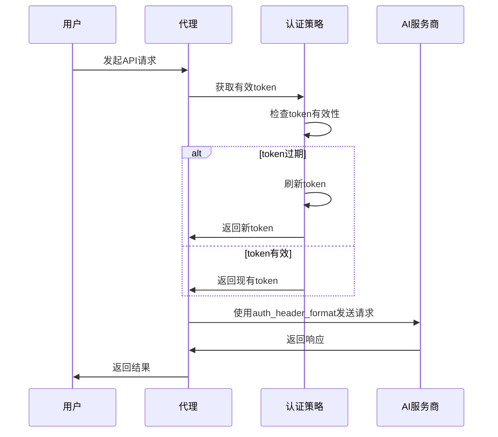

# 多认证系统实施详细计划

## 项目概述

基于统一认证接口方案，实现Claude Max OAuth认证和Gemini CLI多种认证方式支持。采用双层认证分离架构，确保向后兼容性和架构清晰性。

## 核心设计原则

### 统一认证接口
- `api_key` 字段：统一存储最终用于请求的token
- `auth_type` 字段：指定具体认证类型
- `auth_config_json` 字段：存储认证类型特定的元数据

### 双层认证分离
- **代理层**: `auth_header_format`（代理→服务商认证格式，如"X-goog-api-key: {token}"）  
- **用户层**: `auth_configs_json`（用户认证配置，如OAuth参数）

## 详细实施计划

## 阶段一：数据库架构修改

### 任务1：修改 provider_types 表结构
**文件**: `migration/src/m20240101_000004_create_provider_types_table.rs`

**修改内容**:
```sql
-- 替换单一认证类型为多认证类型支持
-- 删除：AuthType 字段
-- 新增：SupportedAuthTypes json字段 
-- 新增：AuthConfigsJson json字段
-- 保留：AuthHeaderFormat 字段
```

**字段定义**:
```rust
.col(
    ColumnDef::new(ProviderTypes::SupportedAuthTypes)
        .json()
        .not_null()
        .default("[]"),
)
.col(
    ColumnDef::new(ProviderTypes::AuthHeaderFormat)  // 保留不变
        .string_len(255)
        .not_null()
        .default("Authorization: Bearer {key}"),
)
.col(ColumnDef::new(ProviderTypes::AuthConfigsJson).json())
```

**初始化数据示例**:
```rust
// Claude配置
.values_panic([
    "claude".into(),
    "Anthropic Claude".into(), 
    "api.anthropic.com".into(),
    "anthropic".into(),
    "claude-3.5-sonnet".into(),
    "[\"api_key\", \"oauth2\"]".into(),  // supported_auth_types
    "Authorization: Bearer {token}".into(), // auth_header_format
    // config_json, token_mappings_json, model_extraction_json ...
    r#"{
        "api_key": {},
        "oauth2": {
            "authorize_url": "https://claude.ai/oauth/authorize",
            "token_url": "https://console.anthropic.com/v1/oauth/token",
            "client_id": "9d1c250a-e61b-44d9-88ed-5944d1962f5e",
            "redirect_uri": "https://console.anthropic.com/oauth/code/callback",
            "scopes": "org:create_api_key user:profile user:inference",
            "pkce_required": true
        }
    }"#.into(), // auth_configs_json
])

// Gemini配置  
.values_panic([
    "gemini".into(),
    "Google Gemini".into(),
    "generativelanguage.googleapis.com".into(),
    "gemini".into(),
    "gemini-2.5-flash".into(),
    "[\"api_key\", \"google_oauth\", \"service_account\", \"adc\"]".into(),
    "X-goog-api-key: {token}".into(), // 保留现有格式
    // 其他字段...
    r#"{
        "api_key": {},
        "google_oauth": {
            "authorize_url": "https://accounts.google.com/o/oauth2/auth",
            "token_url": "https://oauth2.googleapis.com/token",
            "scopes": "https://www.googleapis.com/auth/generative-language"
        },
        "service_account": {
            "token_url": "https://oauth2.googleapis.com/token", 
            "scopes": "https://www.googleapis.com/auth/generative-language"
        },
        "adc": {
            "scopes": "https://www.googleapis.com/auth/generative-language"
        }
    }"#.into(),
])
```

### 任务2：修改 user_provider_keys 表结构  
**文件**: `migration/src/m20240101_000005_create_user_provider_keys_table.rs`

**修改内容**:
```sql
-- 新增：AuthType字段（指定具体认证类型）
-- 修改：ApiKey字段长度（支持长JWT token）
-- 修改：AuthStatus默认值
-- 保留：AuthConfigJson, AuthStatus, ExpiresAt, LastAuthCheck字段
```

**字段定义**:
```rust
.col(
    ColumnDef::new(UserProviderKeys::AuthType)
        .string_len(30)
        .not_null() 
        .default("api_key"),
)
.col(
    ColumnDef::new(UserProviderKeys::ApiKey)
        .string_len(512)  // 从255增加到512支持JWT
        .not_null(),
)
.col(
    ColumnDef::new(UserProviderKeys::AuthStatus)
        .string_len(20)
        .default("active"), // 从"pending"改为"active"
)
```

## 阶段二：Entity模型更新

### 任务3：更新 provider_types.rs
**文件**: `entity/src/provider_types.rs`

**修改内容**:
```rust
pub struct Model {
    // ... 现有字段 ...
    pub supported_auth_types: Option<String>,  // 新增：JSON数组
    pub auth_header_format: String,            // 保持不变
    pub auth_configs_json: Option<String>,     // 新增：认证配置
    // 删除：pub auth_type: String,
}
```

### 任务4：更新 user_provider_keys.rs
**文件**: `entity/src/user_provider_keys.rs`

**修改内容**:
```rust
pub struct Model {
    // ... 现有字段 ...
    pub auth_type: String,  // 新增：具体认证类型
    // OAuth字段保持不变：auth_config_json, auth_status, expires_at等
}
```

## 阶段三：配置解析系统

### 任务5：创建认证配置结构体
**新文件**: `src/auth/config.rs`

```rust
use serde::{Deserialize, Serialize};
use std::collections::HashMap;

#[derive(Debug, Clone, Serialize, Deserialize)]
pub struct AuthConfigs {
    #[serde(flatten)]
    pub configs: HashMap<String, serde_json::Value>,
}

#[derive(Debug, Clone, Serialize, Deserialize)]
pub struct OAuth2Config {
    pub authorize_url: String,
    pub token_url: String,
    pub client_id: String,
    pub redirect_uri: Option<String>,
    pub scopes: String,
    pub pkce_required: Option<bool>,
}

#[derive(Debug, Clone, Serialize, Deserialize)]
pub struct ServiceAccountConfig {
    pub token_url: String,
    pub scopes: String,
}

#[derive(Debug, Clone, Serialize, Deserialize)]
pub struct ADCConfig {
    pub scopes: String,
}

impl AuthConfigs {
    pub fn supports_auth_type(&self, auth_type: &str) -> bool {
        self.configs.contains_key(auth_type)
    }
    
    pub fn get_oauth2_config(&self, auth_type: &str) -> anyhow::Result<OAuth2Config> {
        let config = self.configs.get(auth_type)
            .ok_or_else(|| anyhow!("Auth config not found: {}", auth_type))?;
        serde_json::from_value(config.clone())
            .map_err(|e| anyhow!("Failed to parse OAuth2 config: {}", e))
    }
    
    pub fn supported_auth_types(&self) -> Vec<String> {
        self.configs.keys().cloned().collect()
    }
}
```

### 任务6：修改 ProviderConfig 结构体
**文件**: `src/config/provider_config.rs`

**修改内容**:
```rust
pub struct ProviderConfig {
    // ... 现有字段 ...
    pub supported_auth_types: Vec<String>,      // 新增：支持的认证类型
    pub auth_header_format: String,             // 保持不变
    pub auth_configs: Option<AuthConfigs>,      // 新增：认证配置
}

impl ProviderConfigManager {
    fn parse_provider_config(&self, provider: provider_types::Model) -> Result<ProviderConfig> {
        // 解析supported_auth_types
        let supported_auth_types: Vec<String> = if let Some(ref types_json) = provider.supported_auth_types {
            serde_json::from_str(types_json).unwrap_or_else(|_| vec!["api_key".to_string()])
        } else {
            vec!["api_key".to_string()]
        };

        // 解析auth_configs_json
        let auth_configs = if let Some(ref configs_json) = provider.auth_configs_json {
            serde_json::from_str::<AuthConfigs>(configs_json).ok()
        } else {
            None
        };

        Ok(ProviderConfig {
            // ... 现有字段 ...
            supported_auth_types,
            auth_header_format: provider.auth_header_format,
            auth_configs,
        })
    }
}
```

## 阶段四：认证处理逻辑更新

### 任务7：修改认证处理逻辑
**文件**: `src/proxy/request_handler.rs`

**核心逻辑变更**:
```rust
// 旧逻辑：根据provider类型分别处理认证
// 新逻辑：统一从api_key字段获取token，使用认证策略确保有效性

async fn apply_authentication(&self, ctx: &mut ProxyContext) -> Result<()> {
    let user_key = &ctx.selected_key;
    let provider_config = &ctx.provider_config;
    
    // 1. 使用认证策略确保token有效性
    let auth_strategy = self.get_auth_strategy(&user_key.auth_type)?;
    let valid_token = auth_strategy.ensure_valid_token(user_key.id).await?;
    
    // 2. 使用provider的auth_header_format格式化
    let auth_header = provider_config.auth_header_format
        .replace("{token}", &valid_token);
        
    // 3. 设置认证头
    ctx.request.headers_mut().insert(
        HeaderName::from_static("authorization"), 
        HeaderValue::from_str(&auth_header)?
    );
    
    Ok(())
}
```

### 任务8：实现认证策略接口
**新文件**: `src/auth/strategy.rs`

```rust
use async_trait::async_trait;

#[async_trait]
pub trait AuthStrategy: Send + Sync {
    /// 确保token有效，返回可用的token
    async fn ensure_valid_token(&self, key_id: i32) -> Result<String>;
    
    /// 初始化认证（如OAuth授权流程）
    async fn initialize_auth(&self, config: &AuthConfig) -> Result<i32>;
}

pub struct ApiKeyStrategy;

#[async_trait]
impl AuthStrategy for ApiKeyStrategy {
    async fn ensure_valid_token(&self, key_id: i32) -> Result<String> {
        // API Key直接返回，无需刷新
        let user_key = self.db.find_user_key(key_id).await?;
        Ok(user_key.api_key)
    }
    
    async fn initialize_auth(&self, _config: &AuthConfig) -> Result<i32> {
        // API Key无需初始化流程
        unimplemented!("API Key auth doesn't need initialization")
    }
}

pub struct OAuth2Strategy {
    db: Arc<DatabaseConnection>,
    crypto: Arc<CryptoService>,
}

#[async_trait]
impl AuthStrategy for OAuth2Strategy {
    async fn ensure_valid_token(&self, key_id: i32) -> Result<String> {
        let user_key = self.db.find_user_key(key_id).await?;
        
        // 检查access_token是否过期
        if user_key.expires_at.map_or(false, |exp| exp < Utc::now()) {
            // 使用refresh_token刷新
            let auth_config: RefreshConfig = serde_json::from_str(
                &user_key.auth_config_json.unwrap_or_default()
            )?;
            
            let new_tokens = self.refresh_oauth_token(&auth_config.refresh_token).await?;
            
            // 更新api_key字段为新的access_token
            self.db.update_user_key_token(key_id, &new_tokens.access_token).await?;
            
            Ok(new_tokens.access_token)
        } else {
            Ok(user_key.api_key)
        }
    }
}
```

## 阶段五：OAuth流程实现

### 任务9：OAuth管理器
**新文件**: `src/auth/oauth.rs`

```rust
pub struct OAuthManager {
    db: Arc<DatabaseConnection>,
    crypto: Arc<CryptoService>,
}

impl OAuthManager {
    pub async fn initiate_oauth_flow(
        &self, 
        user_id: i32,
        provider_config: &ProviderConfig, 
        auth_type: &str
    ) -> Result<String> {
        let oauth_config = provider_config
            .auth_configs.as_ref()
            .and_then(|configs| configs.get_oauth2_config(auth_type).ok())
            .ok_or_else(|| anyhow!("OAuth config not found for {}", auth_type))?;
            
        // 生成PKCE和state
        let code_verifier = generate_code_verifier();
        let code_challenge = generate_code_challenge(&code_verifier);
        let state = generate_state();
        
        // 保存OAuth会话
        let session_id = self.create_oauth_session(
            user_id, provider_id, auth_type, &state, &code_verifier
        ).await?;
        
        // 构建授权URL
        let auth_url = format!(
            "{}?client_id={}&redirect_uri={}&response_type=code&scope={}&state={}&code_challenge={}&code_challenge_method=S256",
            oauth_config.authorize_url,
            oauth_config.client_id,
            urlencoding::encode(&oauth_config.redirect_uri.unwrap_or_default()),
            urlencoding::encode(&oauth_config.scopes),
            state,
            code_challenge
        );
        
        Ok(auth_url)
    }
    
    pub async fn handle_oauth_callback(&self, session_id: &str, code: &str) -> Result<i32> {
        // 处理OAuth回调，交换access_token
        // 存储到user_provider_keys.api_key字段
        // 存储refresh_token到auth_config_json字段
    }
}
```

### 任务10：OAuth API端点
**新文件**: `src/api/oauth.rs`

```rust
// POST /api/oauth/authorize
pub async fn oauth_authorize(
    State(app_state): State<AppState>,
    Json(req): Json<OAuthAuthorizeRequest>,
) -> Result<Json<OAuthAuthorizeResponse>, AppError> {
    let oauth_manager = &app_state.oauth_manager;
    let provider_config = app_state.provider_config_manager
        .get_provider_by_id(req.provider_type_id).await?
        .ok_or_else(|| AppError::not_found("Provider not found"))?;
        
    let auth_url = oauth_manager.initiate_oauth_flow(
        req.user_id,
        &provider_config,
        &req.auth_type
    ).await?;
    
    Ok(Json(OAuthAuthorizeResponse { 
        authorization_url: auth_url,
        session_id: "session_id".to_string() 
    }))
}

// GET /api/oauth/callback/{provider}
pub async fn oauth_callback(
    State(app_state): State<AppState>,
    Path(provider): Path<String>,
    Query(params): Query<OAuthCallbackParams>,
) -> Result<Json<OAuthCallbackResponse>, AppError> {
    let provider_key_id = app_state.oauth_manager
        .handle_oauth_callback(&params.state, &params.code).await?;
        
    Ok(Json(OAuthCallbackResponse {
        success: true,
        provider_key_id,
    }))
}
```

## 阶段六：测试和验证

### 任务11：运行数据库迁移
```bash
# 应用数据库迁移
cargo run --bin migration up

# 验证表结构
sqlite3 data/dev.db ".schema provider_types"
sqlite3 data/dev.db ".schema user_provider_keys"
```

### 任务12：集成测试
```bash
# 编译检查
cargo check

# 运行测试
cargo test auth::tests
cargo test oauth::tests

# 手动测试API Key认证（向后兼容）
curl -X POST http://localhost:8080/v1/chat/completions \
  -H "Authorization: Bearer user_api_key" \
  -d '{"model": "gpt-3.5-turbo", "messages": [{"role": "user", "content": "Hello"}]}'

# 测试OAuth流程
curl -X POST http://localhost:9090/api/oauth/authorize \
  -H "Content-Type: application/json" \
  -d '{"provider_type_id": 1, "auth_type": "oauth2", "name": "My Claude OAuth"}'
```

## 技术细节说明

### 不同认证类型的数据存储

| 认证类型 | api_key字段 | auth_config_json字段 | 说明 |
|---------|-----------|------------------|------|
| api_key | 用户API密钥 | `null`或验证信息 | 直接存储用户输入的密钥 |
| oauth2 | access_token | refresh_token等 | 存储OAuth获取的访问令牌 |
| service_account | 生成的JWT | 私钥+配置 | 存储生成的JWT令牌 |
| adc | 获取的token | 凭据路径 | 存储ADC获取的令牌 |

### 认证流程时序图



## 风险控制

### 向后兼容性保证
- 现有API Key认证逻辑完全不变
- 新字段都有合理默认值
- 数据库迁移支持回滚

### 安全措施
- OAuth使用PKCE防止授权码拦截
- 所有敏感数据加密存储
- Token刷新时验证来源合法性

### 错误处理
- 认证失败时提供清晰错误信息
- OAuth流程异常时自动清理会话
- 数据库操作失败时保持数据一致性

## 时间估算

- 阶段一（数据库修改）：1天
- 阶段二（Entity更新）：0.5天
- 阶段三（配置解析）：1天
- 阶段四（认证逻辑）：1.5天
- 阶段五（OAuth实现）：2天
- 阶段六（测试验证）：1天

**总计：7天**，包含完整开发、测试和验证流程。