# AI 代理平台请求处理流程详细分析

> 基于 Rust + Pingora 的企业级 AI 服务代理平台完整技术流程文档 (2025最新版)

## 🏗️ 系统架构总览

### 双端口分离架构设计

这是一个基于**双端口分离架构**的企业级 AI 服务代理平台，采用以下核心设计：

- **PingoraProxyServer** (端口8080): 专注高性能AI请求代理，基于Pingora 0.6.0原生性能
- **ManagementServer** (端口9090): 专注业务管理逻辑，用户管理、API密钥管理、统计查询
- **共享数据层**: SQLite数据库 + CacheManager + AuthService

### 技术栈组成

- **核心框架**: Rust 2024 Edition + Pingora 0.6.0 + Axum 0.8.4
- **数据库**: SQLite + Sea-ORM 1.x + Sea-ORM-Migration
- **缓存**: Redis with CacheManager (支持内存/Redis后端) + Moka (内存缓存)
- **并发工具**: DashMap, Tokio-Util (DelayQueue)
- **HTTP客户端**: Reqwest
- **认证**: AuthService + JWT + API Key + RBAC + OAuth 2.0
- **追踪**: TraceSystem + ImmediateProxyTracer
- **前端**: React 18 + TypeScript + shadcn/ui (已完成)

## 📊 完整请求处理流程图

```mermaid
flowchart TD
    %% 客户端请求入口
    Client[客户端请求] --> ProxyPort[":8080 PingoraProxyServer"]

    %% 系统启动阶段
    subgraph SystemStartup["🚀 系统启动阶段"]
        MainRS["main.rs:30<br/>dual_port_setup::run_dual_port_servers()"]
        MainRS --> InitShared["initialize_shared_services()"]
        InitShared --> InitDB["初始化数据库连接<br/>crate::database::init_database()"]
        InitShared --> InitComponents["初始化所有共享组件"]

        subgraph SharedComponents["共享组件初始化"]
            InitComponents --> AuthConfig["创建AuthConfig"]
            AuthConfig --> JWTManager["JwtManager::new()"]
            AuthConfig --> ApiKeyManager["ApiKeyManager::new()"]
            JWTManager --> AuthService["AuthService::new()"]
            ApiKeyManager --> AuthService
            AuthService --> AuthService["AuthService::new()"]
            InitComponents --> CacheManager["UnifiedCacheManager::new()"]
            InitComponents --> CollectService["CollectService::new()"]
            InitComponents --> TraceSystem["TraceSystem::new_immediate()"]
            InitComponents --> ApiKeyHealthService["ApiKeyHealthService::new()"]
            InitComponents --> OAuthClient["OAuthClient::new()"]
            InitComponents --> ApiKeyRefreshService["ApiKeyRefreshService::new()"]
            InitComponents --> ApiKeySelectService["ApiKeySelectService::new()"]
            InitComponents --> ApiKeySchedulerService["ApiKeySchedulerService::new()"]
            InitComponents --> OAuthTokenRefreshTask["OAuthTokenRefreshTask::new()"]
            InitComponents --> RateLimitResetTask["RateLimitResetTask::new()"]
            InitComponents --> RateLimiter["RateLimiter::new()"]
        end

        InitShared --> ConcurrentStart["并发启动双端口服务"]
        ConcurrentStart --> StartPingora["PingoraProxyServer::start():8080"]
        ConcurrentStart --> StartManagement["ManagementServer::serve():9090"]
    end

    %% Pingora服务组件构建
    subgraph ProxyBuild["🔧 代理服务构建 (ProxyServerBuilder)"]
        StartPingora --> ProxyBuilder["ProxyServerBuilder::new()"]
        ProxyBuilder --> WithDB["with_database(shared_db)"]
        WithDB --> WithTrace["with_trace_system(trace_system)"]
        WithTrace --> BuildComponents["build_components()"]

        subgraph BuilderSteps["构建器步骤"]
            BuildComponents --> EnsureDB["ensure_database()"]
            EnsureDB --> EnsureCache["ensure_cache()"]
            EnsureCache --> CreateAuth["create_auth_service()"]
            CreateAuth --> CreateProxy["create_proxy_service()"]
        end

        CreateProxy --> ProxyService["ProxyService::new()"]
        ProxyService --> HTTPService["http_proxy_service()"]
        HTTPService --> AddTCP["add_tcp(server_address)"]
        AddTCP --> RegisterService["server.add_service()"]
    end

    %% 请求处理主流程
    ProxyPort --> ProxyServiceImpl["ProxyService (实现 ProxyHttp trait)"]

    subgraph RequestFlow["🔄 请求处理流程 (ProxyHttp 生命周期)"]
        ProxyServiceImpl --> NewCtx["new_ctx()<br/>创建ProxyContext + request_id"]
        NewCtx --> RequestFilter["request_filter(session, ctx)"]

        subgraph RequestFilterDetail["request_filter 详细流程"]
            RequestFilter --> HandleCORS{"method == OPTIONS?"}
            HandleCORS -->|是| Return200["返回200 CORS响应"]
            HandleCORS -->|否| ClientAuth["客户端API密钥认证<br/>AuthService.authenticate_user_service_api()"]
            ClientAuth --> StartTrace["开始追踪<br/>TraceManager::start_trace()"]
            StartTrace --> RateLimitCheck["分布式速率限制<br/>RateLimiter.check_rate_limit()"]
            RateLimitCheck --> LoadProviderConfig["加载Provider配置"]
            LoadProviderConfig --> BackendKeySelection["智能后端API密钥选择<br/>ApiKeySchedulerService.select_api_key_from_service_api()"]
            BackendKeySelection --> UpdateTrace["更新追踪信息"]
        end

        subgraph BackendKeySelectionDetail["⚖️ 智能后端API密钥选择详细"]
            BackendKeySelection --> GetProviderKeyIDs["从user_service_apis获取provider_key_ids"]
            GetProviderKeyIDs --> LoadActiveKeys["从DB加载活跃user_provider_keys"]
            LoadActiveKeys --> FilterValidKeys["初步有效性过滤<br/>(is_active, auth_status, expires_at, health_status)"]
            FilterValidKeys --> FilterHealthyKeys["健康状态过滤<br/>(ApiKeyHealthService)"]
            FilterHealthyKeys --> GetCredential["获取凭证<br/>(ApiKeySelectService)<br/>(OAuth Token自动刷新)"]
            GetCredential --> SelectAlgorithm{"调度策略选择"}
            SelectAlgorithm -->|round_robin| RoundRobin["轮询算法"]
            SelectAlgorithm -->|weighted| Weighted["权重算法"]
            RoundRobin --> SelectedKey["返回ApiKeySelectionResult"]
            Weighted --> SelectedKey
        end

        subgraph OAuthTokenRefreshFlow["🔄 OAuth Token自动刷新流程"]
            GetCredential --> CheckTokenExpiry{"OAuth Token即将过期?"}
            CheckTokenExpiry -->|是| AcquireRefreshLock["获取刷新锁"]
            AcquireRefreshLock --> PerformRefresh["执行Token刷新<br/>(ApiKeyRefreshService.passive_refresh_if_needed())"]
            PerformRefresh --> UpdateSessionDB["更新oauth_client_sessions"]
            UpdateSessionDB --> ReleaseRefreshLock["释放刷新锁"]
            ReleaseRefreshLock --> ReturnNewToken["返回新Access Token"]
            CheckTokenExpiry -->|否| ReturnCurrentToken["返回当前Access Token"]
        end

        UpdateTrace --> UpstreamPeer["upstream_peer(session, ctx)<br/>选择上游节点"]

        subgraph UpstreamSelection["🎯 上游选择"]
            UpstreamPeer --> CheckRetry{"ctx.retry_count > 0?"}
            CheckRetry -->|是| AddDelay["添加重试延迟"]
            CheckRetry -->|否| SelectUpstream["ProviderStrategy 选择 host 或回退 base_url"]
            AddDelay --> SelectUpstream
            SelectUpstream --> BuildPeer["HttpPeer::new(upstream_addr, TLS)"]
        end

        UpstreamPeer --> UpstreamReqFilter["upstream_request_filter()<br/>上游请求过滤"]

        subgraph UpstreamReqProcessing["🔄 上游请求处理"]
            UpstreamReqFilter --> ReplaceAuth["替换认证信息<br/>隐藏客户端API密钥<br/>使用后端API密钥/OAuth Token"]
            ReplaceAuth --> AddReqHeaders["添加必要请求头<br/>User-Agent等"]
        end

        UpstreamReqFilter --> ResponseFilter["response_filter()<br/>响应过滤"]

        subgraph ResponseProcessing["📥 响应处理"]
            ResponseFilter --> CollectRespStats["CollectService<br/>.collect_response_details()"]
            CollectRespStats --> LogRespTime["记录响应时间和状态码"]
        end

        ResponseFilter --> ResponseBodyFilter["response_body_filter()<br/>响应体过滤"]

        subgraph ResponseBodyProcessing["📝 响应体处理"]
            ResponseBodyFilter --> CollectChunks["ctx.response_details<br/>.add_body_chunk()"]
            CollectChunks --> LogChunkSize["记录数据块大小"]
        end

        ResponseBodyFilter --> Logging["logging()<br/>最终日志记录"]

        subgraph FinalProcessing["✅ 最终处理"]
            Logging --> CheckError{"有错误?<br/>检查fail_to_proxy"}
            CheckError -->|是| RecordFailure["TraceManager::record_failure()"]
            CheckError -->|否| FinalizeMetrics["CollectService<br/>.finalize_metrics()"]
            FinalizeMetrics --> RecordSuccess["TraceManager::record_success()"]
            RecordFailure --> ClientResponse["返回客户端响应"]
            RecordSuccess --> ClientResponse
        end
    end

    %% 错误处理分支
    subgraph ErrorHandling["⚠️ 错误处理"]
        ReturnError --> ErrorResponse["错误响应"]
        Return200 --> CorsResponse["CORS响应"]
        ClientAuth -->|失败| AuthError{"认证/配置错误"}
        AuthError -->|401| Auth401["401未授权<br/>API密钥无效"]
        AuthError -->|429| RateLimit429["429速率限制<br/>请求频率过高"]
        AuthError -->|500| Config500["500配置错误<br/>Provider不存在"]
        AuthError -->|503| NoKey503["503无可用密钥<br/>负载均衡失败"]
        Auth401 --> ErrorResponse
        RateLimit429 --> ErrorResponse
        Config500 --> ErrorResponse
        NoKey503 --> ErrorResponse
    end

    %% 重试机制 (Pingora内置)
    subgraph RetryMechanism["🔄 重试机制"]
        Logging --> FailToProxy{"fail_to_proxy事件?<br/>上游连接失败"}
        FailToProxy -->|是| CheckRetryable{"可重试错误?<br/>网络超时等"}
        CheckRetryable -->|是| CheckRetryCount{"ctx.retry_count < max_retries?"}
        CheckRetryCount -->|是| IncrementRetry["ctx.retry_count++<br/>更新重试计数"]
        IncrementRetry --> RetryDelay["添加指数退避延迟"]
        RetryDelay --> UpstreamPeer
        CheckRetryCount -->|否| MaxRetriesReached["达到最大重试次数<br/>返回502错误"]
        CheckRetryable -->|否| NonRetryableError["不可重试错误<br/>如4xx状态码"]
        MaxRetriesReached --> ErrorResponse
        NonRetryableError --> ErrorResponse
    end

    ClientResponse --> Client
    ErrorResponse --> Client
    CorsResponse --> Client

    %% 样式定义
    classDef startEnd fill:#e1f5fe
    classDef process fill:#f3e5f5
    classDef decision fill:#fff3e0
    classDef error fill:#ffebee
    classDef success fill:#e8f5e8
    classDef component fill:#e8f2ff

    class Client,ProxyPort startEnd
    class ProxyServiceImpl,RequestFilter,PrepareProxy,UpstreamPeer process
    class CheckProxyReq,HandleCORS,CheckError,FailToProxy decision
    class ReturnError,Auth401,RateLimit429,Config500,NoKey503 error
    class ClientResponse,CompleteTraceSuccess success
    class ProxyBuilder,BuildComponents,CreateProxy component
```



## 🔍 关键组件详细说明

### 1. 系统启动流程 (`src/main.rs` → `src/dual_port_setup.rs`)

```rust
main.rs:30 → dual_port_setup::run_dual_port_servers()
├── initialize_shared_services() // 初始化所有共享服务
│   ├── 配置加载和数据库初始化
│   ├── 认证系统组件创建
│   │   ├── AuthConfig::default()
│   │   ├── JwtManager::new()
│   │   ├── ApiKeyManager::new()
│   │   ├── AuthService::new()
│   │   └── OAuthClient::new() // OAuth客户端
│   │   ├── ApiKeyRefreshService::new() // OAuth Token智能刷新服务
│   │   ├── ApiKeySelectService::new() // 智能API密钥提供者
│   │   └── OAuthTokenRefreshTask::new() // OAuth Token刷新后台任务
│   ├── 缓存与辅助组件
│   │   └── UnifiedCacheManager::new()
│   ├── 其他服务组件
│   │   ├── CollectService::new()
│   │   ├── TraceSystem::new_immediate()
│   │   ├── ApiKeyHealthService::new() // API密钥健康检查服务
│   │   ├── RateLimitResetTask::new() // 限流重置后台任务
│   │   ├── ApiKeySchedulerService::new() // API密钥调度服务
│   │   └── RateLimiter::new() // 分布式速率限制器
│   └── SharedServices 结构体封装
└── tokio::select! 并发启动双端口服务
    ├── ManagementServer::serve() :9090
    └── PingoraProxyServer::start() :8080
```

**关键代码路径：**
- `src/main.rs:30`: `dual_port_setup::run_dual_port_servers()`
- `src/dual_port_setup.rs:132`: `initialize_shared_services()`
- `src/dual_port_setup.rs:262`: 初始化追踪系统（TraceSystem）

### 2. 代理服务构建 (`src/proxy/pingora_proxy.rs` + `src/proxy/builder.rs`)

```rust
PingoraProxyServer::start()
├── 创建Pingora Server配置
├── ProxyServerBuilder构建流程
│   ├── ProxyServerBuilder::new(config)
│   ├── with_database(shared_db) // 使用共享数据库
│   ├── with_trace_system(trace_system) // 关键：传递追踪系统
│   └── build_components() // 按依赖顺序构建
│       ├── ensure_database() → 复用共享连接
│       ├── ensure_cache() → UnifiedCacheManager
│       ├── create_auth_service() → AuthService
│       └── create_proxy_service() → ProxyService实例
├── http_proxy_service(proxy_service) // Pingora HTTP服务
├── add_tcp(server_address) // 添加TCP监听
└── server.run_forever() // 启动服务器
```

**关键代码路径：**
- `src/proxy/pingora_proxy.rs:82`: `start()` 方法
- `src/proxy/builder.rs:174`: `build_components()`
- `src/proxy/builder.rs:148`: `create_proxy_service()`
- `src/proxy/service.rs:32`: `ProxyService::new()`

### 3. 请求处理核心链路 (`src/proxy/service.rs`)

```rust
ProxyService (实现 ProxyHttp trait):
├── new_ctx() → 创建ProxyContext + request_id
├── request_filter(session, ctx):97
│   ├── OPTIONS方法的CORS预检处理
│   └── ProxyService::early_request_filter() // 编排器核心逻辑
│       ├── AuthService::authenticate_user_service_api() // 客户端API密钥认证
│       ├── TraceManager::start_trace() // 开始追踪
│       ├── RateLimiter::check_rate_limit() // 分布式速率限制检查
│       ├── ApiKeySchedulerService::select_api_key_from_service_api() // 智能后端API密钥选择
│       └── 填充 ctx.user_service_api / ctx.provider_type / ctx.selected_backend
├── upstream_peer(session, ctx) // 选择上游节点
│   ├── 重试延迟处理 (如果ctx.retry_count > 0)
│   └── HttpPeer::new(provider.base_url, TLS)
├── upstream_request_filter() // 上游请求过滤
│   ├── 替换认证信息 (隐藏客户端密钥，使用后端密钥/OAuth Token)
│   └── 添加必要请求头
├── response_filter() // 响应处理
│   └── CollectService::collect_response_details()
├── response_body_filter() // 响应体收集
│   └── ctx.response_details.add_body_chunk() // 流式与非流式统一收集
└── logging() // 最终处理
    ├── CollectService::finalize_metrics() // 统一流/非流：使用 usage_model::finalize_eos
    ├── 更新token使用信息和成本计算（通过 TokenFieldExtractor + PricingCalculatorService）
    └── TraceManager::record_success/record_failure()
```

**关键代码路径：**
- `src/proxy/service.rs`: `request_filter()`
- `src/proxy/service.rs`: `upstream_peer()`
- `src/proxy/service.rs`: `upstream_request_filter()`
- `src/proxy/service.rs`: `logging()`

### 4. 认证流程 (`src/auth/service.rs` & `src/auth/api_key_select_service.rs`)

**客户端API密钥认证 (`AuthService.authenticate_user_service_api`)**:
- `AuthService` 负责验证客户端请求中携带的 `user_service_apis` API密钥。
- 流程包括从数据库查询 `user_service_apis` 记录，验证其活跃状态和过期时间。

**后端API密钥/OAuth Token获取 (`ApiKeySelectService.get_valid_credential`)**:
- `ApiKeySelectService` 提供统一接口，用于获取后端AI服务商的API密钥或OAuth Access Token。
- **缓存检查**: 首先检查内存缓存中是否有有效的凭证。
- **数据库加载**: 如果缓存中没有，则从数据库加载 `user_provider_keys` 记录。
- **OAuth Token处理**:
    - 如果是OAuth类型的密钥，`ApiKeySelectService` 会调用 `ApiKeyRefreshService.passive_refresh_if_needed()` 进行被动刷新。
    - `ApiKeyRefreshService` 会检查Token是否即将过期，如果需要则使用 `OAuthClient` 进行刷新，并更新 `oauth_client_sessions` 表。
    - 刷新过程中会使用锁机制防止并发刷新。
- **凭证返回**: 返回有效的API密钥字符串或OAuth Access Token。

**关键代码路径：**
- `src/auth/service.rs`: `authenticate_user_service_api()`
- `src/auth/api_key_select_service.rs`: `get_valid_credential()`
- `src/auth/api_key_refresh_service.rs`: `passive_refresh_if_needed()`
- `src/auth/oauth_client/mod.rs`: `OAuthClient` 及其子模块

### 5. API密钥调度服务 (`src/key_pool/pool_manager.rs`)

`ApiKeySchedulerService` 是核心的API密钥调度器，负责从用户的API密钥池中智能选择最合适的密钥。它整合了认证状态、健康检查、速率限制和调度算法，以确保高可用性和性能。

**密钥选择流程 (`select_api_key_from_service_api`)**:
1.  **获取候选密钥ID**: 从 `user_service_apis.user_provider_keys_ids` 中解析出用户配置的后端API密钥ID列表。
2.  **加载活跃密钥**: 从数据库加载这些ID对应的 `user_provider_keys` 记录，并过滤掉非活跃密钥。
3.  **初步有效性过滤 (`filter_valid_keys`)**:
    *   检查密钥的 `is_active` 状态。
    *   对于OAuth类型的密钥，检查其 `auth_status` (必须为 `authorized`)。
    *   检查密钥的 `expires_at` (确保未过期)。
    *   检查密钥的 `health_status` (排除 `unhealthy` 状态，并处理 `rate_limited` 状态的恢复)。
4.  **健康状态过滤 (`filter_healthy_keys`)**:
    *   调用 `ApiKeyHealthService` 获取所有健康的密钥ID。
    *   结合密钥自身的 `health_status` 字段（特别是 `rate_limited` 状态下的 `rate_limit_resets_at`），进一步过滤出当前可用的健康密钥。
    *   **降级策略**: 如果所有密钥都不健康，系统将进入降级模式，使用所有通过初步有效性过滤的密钥进行尝试，以避免完全中断服务。
5.  **凭证获取与刷新**: 对于OAuth类型的密钥，`ApiKeySelectService` 会在需要时自动获取或刷新Access Token，确保调度器总是拿到有效的凭证。
6.  **调度算法选择**: 根据 `user_service_apis.scheduling_strategy` (如 `RoundRobin`, `Weighted`) 选择相应的 `ApiKeySelector`。
7.  **执行调度**: 选定的 `ApiKeySelector` 从过滤后的健康密钥池中，根据其算法（如轮询、权重）选择最终的API密钥。

**关键代码路径：**
- `src/key_pool/pool_manager.rs`: `select_api_key_from_service_api()`
- `src/key_pool/algorithms.rs`: `ApiKeySelector` trait 实现
- `src/key_pool/api_key_health.rs`: `ApiKeyHealthService`
- `src/auth/api_key_select_service.rs`: `ApiKeySelectService`

### 6. 采集与追踪 (`src/collect/service.rs` + `src/trace/manager.rs`)

```rust
Collect → Trace 生命周期：
├── TraceManager::start_trace() // 认证成功后开始追踪
│   ├── 记录 request_id, user_service_api_id, 用户信息
│   ├── 记录请求方法、路径、客户端 IP、User-Agent
│   └── ImmediateProxyTracer 即时写入数据库
├── TraceManager::update_model() // API 密钥和模型解析后更新
│   ├── provider_type_id: 服务商类型 ID
│   ├── model_used: 实际使用的模型
│   └── user_provider_key_id: 后端 API 密钥 ID
├── CollectService::collect_response_details() // 响应头采集
│   ├── 记录状态码、Content-Type、压缩编码
│   └── 补充上下文中的响应字段
├── CollectService::finalize_metrics() // 响应体收集完成后
│   ├── usage_model::finalize_eos() 聚合流式/非流式事件
│   ├── TokenFieldExtractor 提取 token 统计
│   ├── extract_model_from_json() 推断模型名称
│   └── PricingCalculatorService 计算成本
└── TraceManager::record_success/record_failure()
    ├── 成功: 记录状态码、token 使用量、成本
    └── 失败: 记录错误类型、错误信息并写入限流缓存
```

**关键代码路径：**
- `src/trace/manager.rs`: `start_trace()`, `update_model()`, `record_success()`, `record_failure()`
- `src/collect/service.rs`: `collect_response_details()`, `finalize_metrics()`
- `src/collect/usage_model.rs`: `finalize_eos()`、`extract_model_from_json()`
- `src/collect/field_extractor.rs`: `TokenFieldExtractor`
- `src/trace/immediate.rs`: `ImmediateProxyTracer`

### 7. 统一日志与统计（关键约定）

- 日志头部统一：
  - 下游请求头：`event=downstream_request_headers`，字段：`client_headers_json`
  - 上游请求头：`event=upstream_request_ready`，字段：`upstream_headers_json`
  - 上游响应头：`event=upstream_response_headers`，字段：`response_headers_json`
- 错误日志合并：
  - `event=request_failed`，统一记录：`method,url,error_type,error_source,error_message,duration_ms,request_headers_json,selected_backend_id,provider_type,timeout_seconds`
- 统计统一入口：
  - `CollectService::finalize_metrics(ctx, status_code)` 统一流/非流：基于 `usage_model::finalize_eos()` 聚合事件，再使用 `token_mappings_json + TokenFieldExtractor` 提取 `tokens_*` 与模型，随后计算费用

### 8. OAuth 2.0 授权系统 (`src/auth/oauth_client/` 模块群)

OAuth 2.0 授权系统是平台认证模块的核心组成部分，负责处理与第三方OAuth Provider的交互，包括授权码流程、PKCE安全机制、Token交换、以及Access Token的智能刷新和生命周期管理。

**核心组件**:
- **`OAuthClient` (`src/auth/oauth_client/mod.rs`)**: OAuth模块的入口，封装了所有OAuth操作，协调各个子组件。
- **`OAuthProviderManager` (`src/auth/oauth_client/providers.rs`)**: 管理OAuth Provider的配置，支持从数据库动态加载。
- **`SessionManager` (`src/auth/oauth_client/session_manager.rs`)**: 管理 `oauth_client_sessions` 表中的OAuth会话生命周期。
- **`TokenExchangeClient` (`src/auth/oauth_client/token_exchange.rs`)**: 负责与OAuth Provider的Token端点交互，执行授权码交换和Token刷新。
- **`AutoRefreshManager` (`src/auth/oauth_client/auto_refresh.rs`)**: 封装了Token自动刷新和孤立会话清理的核心逻辑。
- **`ApiKeyRefreshService` (`src/auth/api_key_refresh_service.rs`)**: 实现了被动和主动的Token刷新逻辑，处理并发刷新锁。
- **`OAuthTokenRefreshTask` (`src/auth/api_key_refresh_task.rs`)**: 后台任务，使用 `DelayQueue` 调度和执行主动Token刷新。
- **`ApiKeySelectService` (`src/auth/api_key_select_service.rs`)**: 智能凭证提供者，为代理端提供统一的API密钥/OAuth Token获取接口，并触发被动刷新。
- **`PKCE` (`src/auth/oauth_client/pkce.rs`)**: 实现了PKCE安全机制，防止授权码拦截攻击。

**OAuth 2.0 完整授权流程**:
1.  **启动授权**: 客户端调用 `OAuthClient.start_authorization()`，系统生成PKCE参数和会话ID，并返回授权URL。
2.  **用户授权**: 用户在OAuth Provider完成授权，Provider将授权码重定向回AI Proxy。
3.  **Token交换**: AI Proxy使用授权码和PKCE `code_verifier` 调用 `OAuthClient.exchange_token()`，从Provider获取Access Token和Refresh Token。
4.  **会话存储**: 获取到的Token和相关信息存储在 `oauth_client_sessions` 表中。
5.  **Token刷新**:
    *   **被动刷新**: 当 `ApiKeySelectService` 请求OAuth Token时，如果发现Token即将过期，会触发 `ApiKeyRefreshService` 进行被动刷新。
    *   **主动刷新**: `OAuthTokenRefreshTask` 后台任务定期检查并刷新即将过期的Token。
6.  **凭证获取**: `ApiKeySelectService` 负责向代理端提供有效的Access Token，透明处理Token的获取和刷新。

**关键代码路径：**
- `src/auth/oauth_client/mod.rs`: `OAuthClient`
- `src/auth/api_key_refresh_service.rs`: `ApiKeyRefreshService`
- `src/auth/api_key_refresh_task.rs`: `OAuthTokenRefreshTask`
- `src/auth/api_key_select_service.rs`: `ApiKeySelectService`
- `src/auth/oauth_client/auto_refresh.rs`: `AutoRefreshManager`
- `src/auth/oauth_client/pkce.rs`: `PkceParams`
- `entity/oauth_client_sessions.rs`: OAuth会话数据库实体

### 9. API密钥健康检查服务 (`src/key_pool/api_key_health.rs`)

`ApiKeyHealthService` 负责对API密钥进行主动健康检查，评估其可用性和性能，并根据检查结果更新密钥的健康状态。它集成了错误分类、健康评分和与数据库的同步机制，确保调度器能够获取到最准确的密钥健康信息。

**核心流程**:
1.  **状态读写**: 该服务主要提供 `user_provider_keys` 健康状态的读写接口（不再执行“主动探测/健康检查请求”）。
2.  **错误驱动更新**: 健康状态通常由代理请求链路中的错误/限流信息驱动更新（例如 429 触发 `rate_limited`，或网络/鉴权错误触发 `unhealthy`）。
3.  **同步到数据库**: 将健康状态（`health_status`, `health_status_detail`, `rate_limit_resets_at`, `last_error_time`）持久化到 `user_provider_keys` 表中。
4.  **限流重置调度**: 当密钥进入 `rate_limited` 且存在 `rate_limit_resets_at` 时，由 `RateLimitResetTask` 负责按时间自动重置为 `healthy`。

**关键代码路径：**
- `src/key_pool/api_key_health.rs`: `ApiKeyHealthService`
- `src/key_pool/api_key_health.rs`: `mark_key_unhealthy()`
- `src/key_pool/api_key_health.rs`: `mark_key_rate_limited()`
- `src/key_pool/api_key_health.rs`: `reset_key_status()`

## 🎯 核心设计特点

### 1. 透明代理设计
- **设计理念**: 用户决定发送什么格式给什么提供商，系统只负责认证和密钥替换
- **实现方式**: 简化的请求处理，专注于认证和转发
- **路径识别**: 从URL路径 `/{provider}/{api_path}` 自动识别服务商
- **代码位置**: `src/proxy/service.rs:63`

### 2. 数据驱动配置  
- **Provider配置**: 直接从 `provider_types` 表加载认证头格式、超时时间、base_url 等
- **认证头格式**: 支持 JSON 数组配置多种认证方式 (`auth_header_format`)
- **Token映射**: 使用 `token_mappings_json` 和 `model_extraction_json` 数据驱动提取
- **超时配置**: 从 `user_service_apis.timeout_seconds` 动态获取
- **代码位置**: `entity::provider_types`, `src/providers/field_extractor.rs`

### 3. 协调器模式
- **设计思想**: `ProxyService` 作为协调器，委托专门服务处理各环节  
- **服务分离**: 
  - AuthenticationService: 认证逻辑
  - TraceManager: 追踪管理
  - CollectService: 采集解析
  - ProviderStrategy: 服务商特定行为
- **代码位置**: `src/proxy/service.rs`

### 4. 智能重试机制
- **重试条件**: 基于Pingora内置的 `fail_to_proxy` 事件触发
- **支持场景**: 网络错误、超时错误等临时故障 (可重试错误)
- **重试策略**: 指数退避延迟 + 最大重试次数限制
- **OAuth集成**: 配合SmartApiKeyProvider和OAuthClient自动token刷新
- **代码位置**: 流程图中的重试机制部分

### 5. 源信息隐藏
- **安全设计**: AI服务商完全无法看到真实客户端信息和API密钥
- **实现方式**: 在 `upstream_request_filter` 中替换所有认证信息
- **密钥替换**: 客户端API密钥 → 后端API密钥 (从负载均衡选择)
- **代码位置**: `src/proxy/service.rs:270`

### 6. 统一追踪系统
- **追踪架构**: TraceSystem + ImmediateProxyTracer
- **即时写入**: 所有请求都被即时写入数据库，确保数据不丢失
- **完整生命周期**: 从认证开始到响应完成的全程追踪
- **错误处理**: 专门的错误类型分类和追踪
- **代码位置**: `src/trace/`目录

## 🛠️ 开发和调试要点

### 重要配置文件位置
- 主配置: `config/config.toml` 
- 双端口配置: `config/dual_port_config.rs`
- 数据库迁移: `migration/`
- 实体定义: `entity/`
- Provider配置: 数据库动态管理

### 关键日志点和调试信息
- **系统启动**: 
  - `dual_port_setup::initialize_shared_services()` - 共享服务初始化
  - `ProxyServerBuilder::build_components()` - 代理服务构建
- **请求处理**:
  - `request_id` 生成和传递 - 全链路追踪标识
  - `ProviderResolver::resolve_from_request()` - 服务商识别
  - 认证结果: 用户ID和API密钥预览 (已脱敏)
- **负载均衡**: 
  - `ApiKeyPoolManager::select_api_key_from_service_api()` - 密钥选择
  - 选中的后端密钥ID、选择策略和原因
- **上游处理**:
  - HttpPeer构建和连接信息
  - 重试计数和延迟信息
- **响应处理**:
  - Token使用量提取 (使用TokenFieldExtractor)
  - 模型名称提取 (使用ModelExtractor)
  - 成本计算和货币信息

### 故障排查指南
1. **认证失败**: 
   - 检查 `AuthenticationService::parse_inbound_api_key_from_client()` 日志
   - 验证 `provider.auth_header_format` 配置是否正确
   - 确认 `AuthHeaderParser::parse_api_key_from_inbound_headers_smart()` 解析结果
   - 检查错误自动转换 `From<AuthParseError> for ProxyError` 是否正常
   - 确认 `AuthService` 认证流程
2. **负载均衡异常**: 
   - 查看 `ApiKeyPoolManager::select_api_key_from_service_api()` 输出
   - 检查 `user_provider_keys_ids` JSON数组解析
   - 验证 `ApiKeyHealthChecker` 健康检查结果
3. **上游连接问题**: 
   - 关注 `fail_to_proxy` 事件和重试逻辑
   - 检查 provider.base_url 配置
   - 验证 TLS/SSL 证书问题
4. **追踪数据丢失**: 
   - 确认 `TraceSystem::new_immediate()` 正确初始化
   - 检查 `ImmediateProxyTracer` 数据库写入权限
   - 验证 `TraceManager` 是否正确传递给RequestHandler
5. **统计数据异常**:
   - 检查响应体格式 (SSE vs 传统JSON)
   - 验证 `token_mappings_json` 配置
   - 确认 `model_extraction_json` 映射规则

### 性能监控指标
- **请求层面**:
  - 请求响应时间 (`response_time_ms`)
  - 认证耗时和成功率
  - 负载均衡选择耗时
- **业务层面**:
  - Token使用量 (prompt/completion/total)
  - 模型使用分布
  - 成本统计和趋势
- **系统层面**:
  - 重试次数和成功率 (`retry_count`)
  - 上游连接状态 (`upstream_connection_status`)
  - 数据库连接池状态
  - 缓存命中率 (CacheManager)
- **OAuth 2.0监控**:
  - Token刷新成功率和耗时
  - OAuth会话状态和活跃度
  - 第三方提供商连接状态
- **健康监控指标**:
  - API密钥健康状态分布
  - 自动故障恢复次数
  - 健康检查响应时间
  - 密钥池可用性比例

### 架构扩展要点
- **新增Provider**: 更新数据库配置，无需代码修改
- **新增认证方式**: 扩展 `auth_header_format` JSON配置
- **新增调度算法**: 实现 `ApiKeySelector` trait
- **新增追踪器**: 实现 `ProxyTracer` trait 并集成到 TraceSystem
- **新增OAuth提供商**: 实现OAuthProvider trait并注册到OAuthClient
- **新增健康检查策略**: 实现HealthCheckStrategy trait
- **扩展前端功能**: 基于React 18 + shadcn/ui的组件化开发

### 🚀 2025年新增核心功能总结
1. **OAuth 2.0集成**: 完整的授权流程，支持自动token刷新和多种第三方提供商
2. **智能API密钥管理**: SmartApiKeyProvider提供动态密钥选择和故障恢复
3. **健康监控系统**: 实时API密钥健康检查，自动故障检测和恢复机制
4. **统一追踪系统**: ImmediateProxyTracer确保所有请求都被完整记录到数据库
5. **React管理界面**: 完整的React 18前端应用，提供现代化的用户管理体验
6. **后台任务调度**: OAuthTokenRefreshTask确保服务的持续可用性

这个文档基于实际源码深度分析提供了完整的技术参考，确保团队成员能够准确理解系统架构并高效进行开发维护工作。
